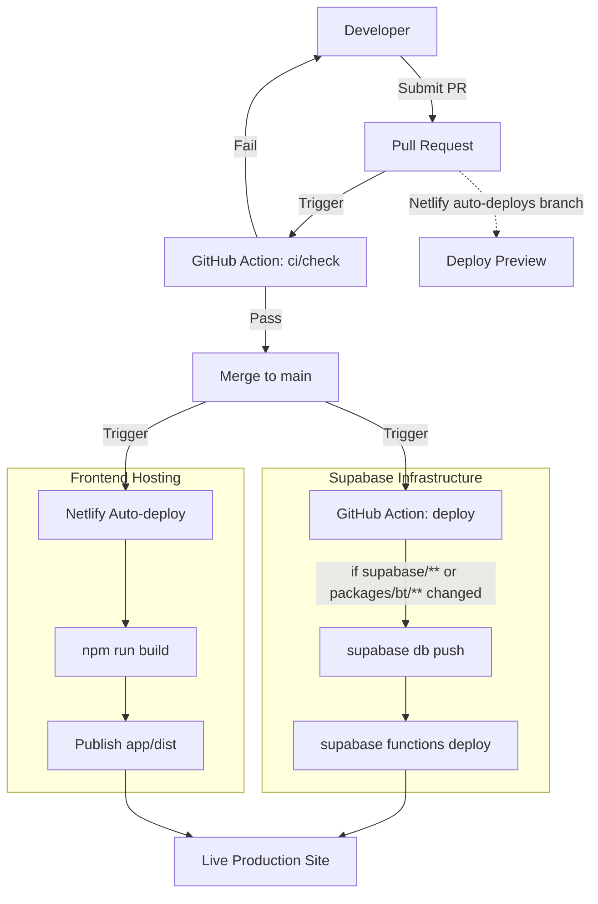

# CoasterRank

A multi-user webapp where roller-coaster enthusiasts rank the coasters they've ridden, and every visitor sees a live global ranking derived from everyone's input.

## Vision

- **Users** sign up, mark the coasters they've ridden, and drag-sort them into a personal ranked list.
- **Everyone** (no login required) sees a live public board of the world's coasters ordered by a principled, community-driven score — not a popularity contest, not a simple average.
- The ranking is computed by a **Bradley-Terry** model fed from pairwise wins implied by each user's ordered list. Each user contributes roughly one unit of influence regardless of list length, so a casual fan's voice isn't drowned out by someone who's ridden 500 coasters.
- The reference catalog of coasters starts from an open, public-domain dataset and grows via an admin + community submission queue (RCDB data is intentionally avoided for licensing reasons).

## Features

- **Live public board** — global ranking recomputed every 15 minutes by a Bradley-Terry model (pg_cron → Supabase Edge Function); no login required.
- **Personal rankings** — sign up, search the catalog, and drag-sort your coasters with auto-save and optimistic updates.
- **Search & filters** — park, country, manufacturer, material, and status filters mirrored to URL search params; operating-only by default.
- **Seeded catalog** — 1,087 coasters / 279 parks / 101 manufacturers imported from a CC0 public-domain dataset.
- **Submissions & moderation** — users propose missing coasters; admins review the queue, add or edit entries, and re-home orphaned rows.
- **Coaster & park detail pages**, plus an admin dashboard with a manual rankings-recompute trigger.

## Status

All v1 phases complete (scaffold → live Bradley-Terry rankings → admin & moderation). Go-live checklist pending. See [`docs/PLAN.md`](docs/PLAN.md) for the full lifecycle plan (architecture, data model, algorithm, environment, deployment, phasing).

## Tech stack

- **Frontend**: React 19 + Vite + TypeScript SPA (Tailwind CSS, TanStack Query, React Router)
- **Data / Auth**: Supabase (Postgres + PostgREST + Auth + Row-Level Security) — dedicated instance, develop against prod
- **Ranking**: Bradley-Terry batch job as a Supabase Edge Function, scheduled via pg_cron
- **Hosting**: Netlify (SPA, auto-deploy on push to `main`)
- **CI/CD**: GitHub Actions (quality gates on PRs; Supabase migrations + function deploy on merge to `main`)
- **Tooling**: Vitest (tests), oxlint (lint), Prettier (format)

## Deployment Workflow



## Repo layout

```
app/            # Vite + React + TypeScript SPA (the whole frontend)
supabase/       # CLI config, SQL migrations, Edge Functions (Deno)
packages/bt/    # pure-TS Bradley-Terry MM fitting — own package.json
scripts/        # data-engineering (CC0 coaster import) — own package.json
data/           # reference datasets (coaster_db.csv, CC0)
docs/           # PLAN.md (plan & decisions), RUNBOOKS.md (ops runbooks)
```

Note: `app/`, `scripts/`, and `packages/bt/` each have their **own** `package.json` (no root workspace).

## Getting started

Prereqs: Node 22+, npm, the Supabase CLI (`npm i -g supabase`).

```bash
# 1. Copy env and fill in values from the Supabase dashboard
cp .env.example .env

# 2. Install SPA deps and run the dev server (talks to prod Supabase under RLS)
cd app
npm install
npm run dev          # http://localhost:5173

# 3. Quality gates (run before every commit; CI runs the same)
npm run typecheck && npm run lint && npm run test:run && npm run format:check
```

Optional packages (only needed for their specific tasks):

```bash
cd scripts && npm install      # coaster catalog import (npm run import-coasters)
cd packages/bt && npm install  # Bradley-Terry algorithm work + tests
```

## Docs

- [`docs/PLAN.md`](docs/PLAN.md) — authoritative project plan and decision log
- [`AGENTS.md`](AGENTS.md) — command reference, environment rules, multi-account Supabase CLI auth
- [`docs/RUNBOOKS.md`](docs/RUNBOOKS.md) — operational runbooks (one-time setup, manual ops)

## License

TBD.
