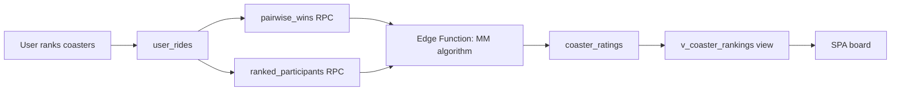
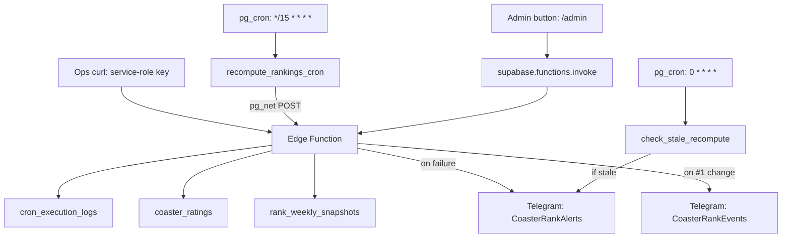

# Rankings

How CoasterRank computes, stores, monitors, and displays coaster rankings.

## Overview

CoasterRank uses a **Bradley-Terry model** to infer latent strengths from pairwise comparisons. Users rank coasters on their "My Coasters" page; the system converts those ordinal lists into pairwise win/loss data, fits a statistical model, and produces a global score per coaster. The board displays coasters sorted by score.



## The Bradley-Terry model

Each coaster _i_ has a positive strength _p_i_. The probability that _i_ beats _j_ in a head-to-head comparison is:

```
P(i beats j) = p_i / (p_i + p_j)
```

Given aggregated pairwise win counts, strengths are fit by the **MM (minorize-maximize) algorithm** (Hunter, 2004) with the fixed-point update:

```
p_i <- (W_i + a/2 + λ) / (Σ_j n_ij / (p_i + p_j) + a / (p_i + 1) + λ)
```

Where:
- **W_i** = coaster _i_'s total weighted wins
- **n_ij** = total weighted comparisons between _i_ and _j_ (both directions)
- **a** = anchor weight (default 1) — virtual comparisons against a synthetic "average" coaster of strength 1.0
- **λ** = L2 shrinkage (default 0.5) — pseudo-counts pulling scores toward 1.0

The algorithm iterates until the max per-item delta falls below ε = 1e-8, or hits a cap of 500 iterations.

**Implementation:** `packages/bt/src/mm.ts` — pure TypeScript, no imports. Shared by the Edge Function (Deno) and the test suite (Vitest).

### Regularization

Two anti-noise measures prevent degenerate scores:

| Mechanism | Default | Purpose |
|-----------|---------|---------|
| **Anchor weight** (`a = 1`) | Virtual 50/50 win/loss against an "average" coaster at strength 1.0 | Anchors the scale (1.0 = average). Prevents undefeated or rarely-compared coasters from running to infinity. A coaster with no comparisons sits at exactly 1.0. |
| **L2 shrinkage** (`λ = 0.5`) | Pseudo-win/loss counts pulling every score toward 1.0 | Shrinks sparse data toward the mean. Equivalent to a Gamma prior in Bayesian estimation. |

### Per-user normalization

A user who ranks 10 coasters generates `10 × 9 / 2 = 45` pairwise comparisons. A user who ranks 3 coasters generates `3 × 2 / 2 = 3` pairs. To prevent power-users from dominating, each pair is weighted at `1 / (n × (n-1) / 2)`, so every user's total influence sums to ~1 regardless of list length.

## Data flow

### Step 1: Pairwise aggregation (SQL RPCs)

Two security-definer RPCs run inside Postgres and are called by the Edge Function via PostgREST with the service-role key. EXECUTE is revoked from anon/authenticated — they are not public APIs.

**`pairwise_wins()`** — Aggregated, per-user-normalized pairwise wins:

```sql
-- Simplified: the real SQL uses window functions for the per-user n count
SELECT winner, loser,
       SUM(pair_weight)::double precision,  -- normalized weight
       COUNT(*)                             -- raw win count
FROM pairs  -- self-join on user_rides where rank_a < rank_b
GROUP BY winner, loser;
```

Returns: `table(winner uuid, loser uuid, weight double precision, wins bigint)`

**`ranked_participants()`** — Distinct users ranking each coaster:

```sql
SELECT coaster_id, COUNT(DISTINCT user_id)
FROM user_rides WHERE rank IS NOT NULL
GROUP BY coaster_id;
```

Returns: `table(coaster_id uuid, participants bigint)`

### Step 2: MM fitting (Edge Function)

The Edge Function (`supabase/functions/recompute-rankings/index.ts`) calls both RPCs in parallel, maps the results into `Pair[]` objects, and feeds them to `computeRankings()`.

The MM algorithm runs in memory. For ~200 coasters and ~1000 pairs, this typically converges in 10-20 iterations in under 100ms.

### Step 3: Persist results

Results are upserted into `coaster_ratings` in chunks of 500:

| Column | Type | Description |
|--------|------|-------------|
| `coaster_id` | uuid PK | FK to coasters |
| `score` | numeric | Fitted BT strength (1.0 = average) |
| `comparisons` | integer | Total raw comparisons involving this coaster |
| `wins` | integer | Raw wins by this coaster |
| `participants` | integer | Distinct users who ranked this coaster |
| `updated_at` | timestamptz | Last recompute timestamp |

Coasters that drop out of every pair (all their comparisons were un-ranked) get their rating rows deleted — they appear as "unrated" on the board.

### Step 3b: Weekly rank snapshot

The same run upserts each ranked coaster into `rank_weekly_snapshots` (PK `coaster_id, week_start`) with the **current ISO week (UTC Monday)** and the coaster's rank (mirroring the view's exact `score desc, id asc` rule):

- Each 15-min run overwrites the current week's row, so a week's row converges to that week's final rank.
- When the week rolls over, the previous week's row freezes and becomes the "↑2 this week" baseline exposed as `rank_last_week` on `v_coaster_rankings`.
- Rows for coasters that leave the board (or a full board wipe) are deleted, so a later return reads as a fresh ranking.

### Step 4: Display

The view `v_coaster_rankings` left-joins `coasters` with `coaster_ratings` and assigns a live rank, plus the previous week's final rank from `rank_weekly_snapshots`:

```sql
SELECT c.*, r.score, r.comparisons, r.participants,
       row_number() OVER (ORDER BY r.score DESC NULLS LAST) AS rank,
       ws.rank AS rank_last_week
FROM coasters c
LEFT JOIN coaster_ratings r ON r.coaster_id = c.id
LEFT JOIN rank_weekly_snapshots ws
  ON ws.coaster_id = c.id
 AND ws.week_start = (date_trunc('week', now() at time zone 'utc') - interval '7 days')::date;
```

The SPA fetches this view, joins parks/manufacturers client-side (cached), and filters by status client-side (default: operating only).

## Triggering recompute



| Trigger | Auth method | Frequency |
|---------|-------------|-----------|
| pg_cron → pg_net → Edge Function | `RECOMPUTE_AUTH_SECRET` (Vault) | Every 15 min |
| Admin "Recompute now" button | Admin JWT (validated server-side) | On-demand |
| curl with service-role key | `SUPABASE_SERVICE_ROLE_KEY` | Manual/ops |

The Edge Function detects trigger source from the bearer token and logs it as `trigger_source` in `cron_execution_logs`.

## Observability

### Execution logging

Every recompute (success or failure) inserts a row into `cron_execution_logs`:

| Column | Description |
|--------|-------------|
| `status` | `success` or `error` |
| `duration_ms` | Wall-clock time of the entire request |
| `trigger_source` | `pg_cron` or `manual` |
| `iterations` | MM iterations run (success only) |
| `converged` | Whether ε threshold was reached (success only) |
| `pairs` | Number of pairwise comparisons fed to MM |
| `updated` | Number of coaster_ratings rows upserted |
| `error_message` | Error text (failure only) |
| `created_at` | Timestamp |

### Alert channels

| Bot | Purpose | Trigger |
|-----|---------|---------|
| CoasterRankAlerts | System failures | Edge Function catch block (immediate) |
| CoasterRankAlerts | Stale detection | `check_stale_recompute` hourly (no success in 1h) |
| CoasterRankAlerts | Health regression | `health-check.yml` 30m smoke (homepage / `/api/ranking` / Supabase / board render) |
| CoasterRankEvents | Business milestones | Global #1 coaster changes |

### Alert coverage matrix

| Failure mode | Detection | Alert |
|-------------|-----------|-------|
| Edge Function crashes | `cron_execution_logs` error row | Telegram (immediate) |
| Edge Function returns error | `cron_execution_logs` error row | Telegram (immediate) |
| Edge Function unreachable | `check_stale_recompute` (hourly) | Telegram (within 1h) |
| pg_cron stopped firing | `check_stale_recompute` (hourly) | Telegram (within 1h) |
| Homepage / API 5xx, stale board, empty catalog, board not rendering | `health-check.yml` (30m) — `scripts/src/health-check.ts` | Telegram (within 30m) |
| Global #1 changes | Edge Function post-recompute check | Telegram (event) |

### Admin Dashboard

The `/admin` page Rankings panel shows:

- **Last successful run**: time ago, duration, pairs → coasters, iterations
- **Last error** (red card): error message, time ago, trigger source
- **Recompute now** button: triggers manual recompute, auto-refreshes the widget via React Query

## Operational queries

```sql
-- Last 10 successful runs with duration trend
SELECT created_at, duration_ms, pairs, updated, iterations
FROM cron_execution_logs
WHERE status = 'success'
ORDER BY created_at DESC LIMIT 10;

-- Average duration over the last 24 hours
SELECT date_trunc('hour', created_at), AVG(duration_ms), COUNT(*)
FROM cron_execution_logs
WHERE status = 'success' AND created_at > now() - interval '24 hours'
GROUP BY 1 ORDER BY 1 DESC;

-- Any failures in the last day?
SELECT created_at, error_message, duration_ms, trigger_source
FROM cron_execution_logs
WHERE status = 'error' AND created_at > now() - interval '1 day'
ORDER BY created_at DESC;

-- Current top 10 on the board
SELECT rank, name, score, comparisons, participants
FROM v_coaster_rankings
WHERE score IS NOT NULL
ORDER BY score DESC LIMIT 10;
```

## Key files

| File | Purpose |
|------|---------|
| `packages/bt/src/mm.ts` | Bradley-Terry MM algorithm (pure TS) |
| `packages/bt/src/mm.test.ts` | Algorithm unit tests |
| `supabase/functions/recompute-rankings/index.ts` | Edge Function: auth, RPC calls, MM, persist, log, alert |
| `supabase/migrations/20260816183756_rankings_view.sql` | `coaster_ratings` table + `v_coaster_rankings` view |
| `supabase/migrations/20260817170724_bt_recompute_pg_cron.sql` | RPCs, `recompute_rankings_cron()`, pg_cron schedule |
| `supabase/migrations/20260829000422_cron_execution_logs.sql` | Execution logging table + RLS |
| `supabase/migrations/20260829011512_stale_recompute_detection.sql` | Hourly stale alert via pg_cron + Vault |
| `supabase/migrations/20260905195557_rank_weekly_snapshots.sql` | Weekly rank-snapshot table (rank-movement baseline) |
| `supabase/migrations/20260905195558_rankings_view_weekly_delta.sql` | View gains `rank_last_week` (prev ISO week's final rank) |
| `app/src/lib/rankMovement.ts` | Client turnover detection + weekly/live movement helpers |
| `app/src/pages/AdminPage.tsx` | Admin Dashboard: Rankings panel with log-based widget |
