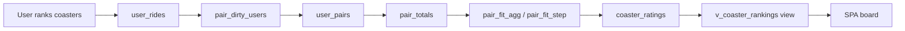
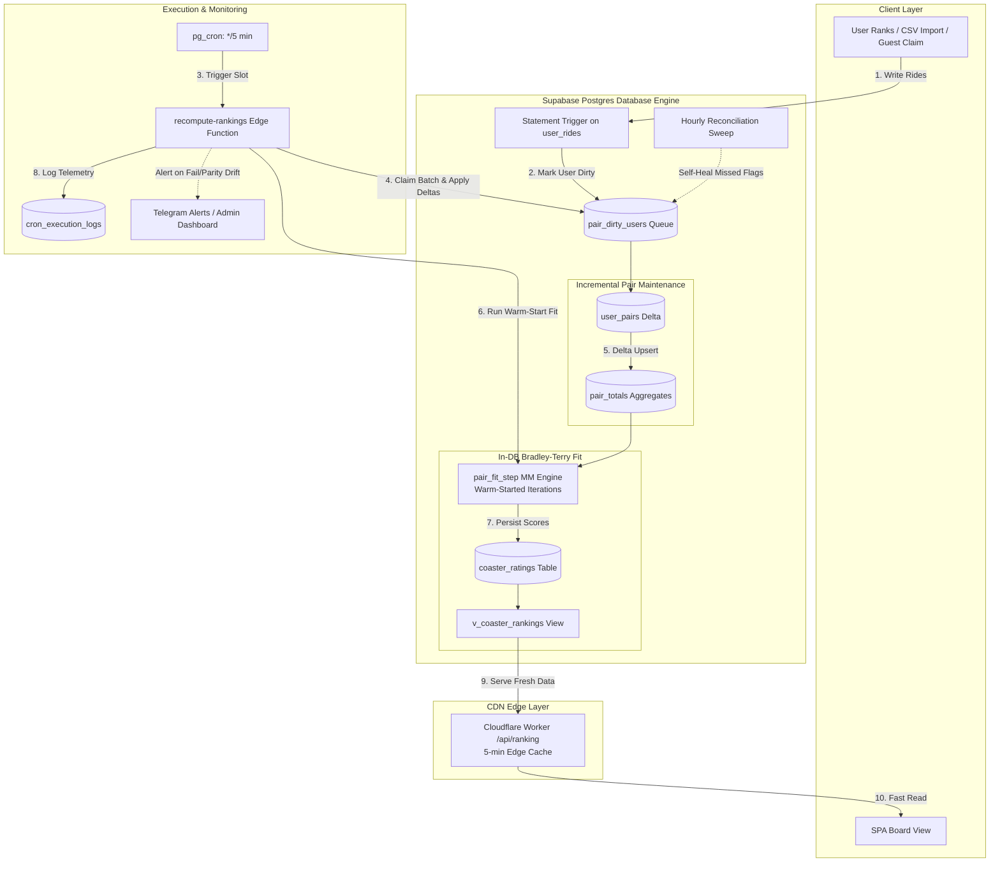
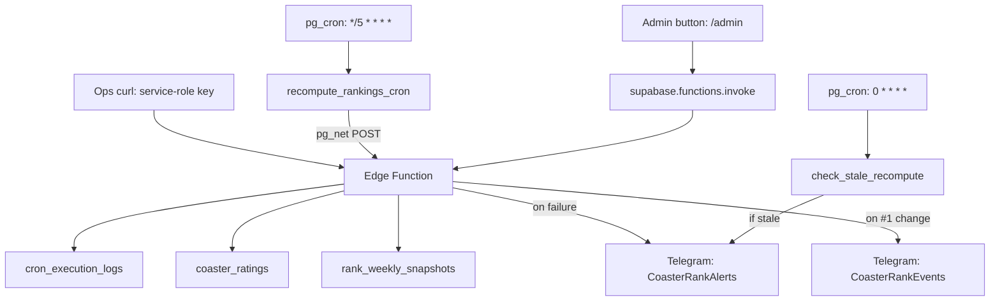

# Rankings

How CoasterRank computes, stores, monitors, and displays coaster rankings.

## Overview

CoasterRank uses a **Bradley-Terry model** to infer latent strengths from pairwise comparisons. Users rank coasters on their "My Coasters" page; the system converts those ordinal lists into pairwise win/loss data, fits a statistical model, and produces a global score per coaster. The board displays coasters sorted by score.



## The Bradley-Terry model

Each coaster _i_ has a positive strength _p_i_. The probability that _i_ beats _j_ in a head-to-head comparison is:

```
P(i beats j) = p_i / (p_i + p_j)
```

Given aggregated pairwise win counts, strengths are fit by the **MM (minorize-maximize) algorithm** (Hunter, 2004) with the fixed-point update:

```
p_i <- (W_i + a/2 + λ) / (Σ_j n_ij / (p_i + p_j) + a / (p_i + 1) + λ)
```

Where:
- **W_i** = coaster _i_'s total weighted wins
- **n_ij** = total weighted comparisons between _i_ and _j_ (both directions)
- **a** = anchor weight (default 1) — virtual comparisons against a synthetic "average" coaster of strength 1.0
- **λ** = L2 shrinkage (default 0.5) — pseudo-counts pulling scores toward 1.0

The algorithm iterates until the max per-item delta falls below ε = 1e-8, or hits a cap of 500 iterations.

**Implementation:** `packages/bt/src/mm.ts` is the pure-TypeScript reference implementation and test oracle. Production runs a parity-checked PL/pgSQL port inside Postgres (`pair_fit_step`) so pair rows never leave the database.

### Regularization

Two anti-noise measures prevent degenerate scores:

| Mechanism | Default | Purpose |
|-----------|---------|---------|
| **Anchor weight** (`a = 1`) | Virtual 50/50 win/loss against an "average" coaster at strength 1.0 | Anchors the scale (1.0 = average). Prevents undefeated or rarely-compared coasters from running to infinity. A coaster with no comparisons sits at exactly 1.0. |
| **L2 shrinkage** (`λ = 0.5`) | Pseudo-win/loss counts pulling every score toward 1.0 | Shrinks sparse data toward the mean. Equivalent to a Gamma prior in Bayesian estimation. |

### Per-rider weighting (evidence-scaled, 2026-09-10)

A user who ranks 10 coasters generates `10 × 9 / 2 = 45` pairwise comparisons; a user who ranks 3 generates 3. Each pair a rider contributes is weighted:

```
w = (P + c)^(−γ)      where P = n(n−1)/2, production: γ = 0.5, c = 28
```

- **Total influence grows ~linearly with list length** (`√P ≈ n/√2`): rank twice as many coasters, get about twice the say. Tiny lists don't get a flat-equalizer bonus, and long/spam lists can't blow up quadratically.
- **Soft floor `c = 28`** (≈ an 8-coaster list's phantom pairs) damps very short lists: a 2-item rider's lone opinion weighs `1/√29 ≈ 0.19` instead of 1.0. Before 2026-09-10, a single 2-item opinion weighed as much as the model's entire anchor prior.
- **Rationale**: flat per-rider equalization (`w = 1/P`, the original rule) made per-opinion influence inversely proportional to list length — a 5-list rider's opinion of a pair outweighed a 90-list rider's ~400×, letting one casual signup decide global #1/#2 — and rewarded ranking as few coasters as possible. Raw counts (γ=0) are the statistical ideal under honest judges but give big/spam lists quadratic, unbounded influence. γ=0.5 is the standard hedge.
- Admins can compare alternatives on demand: the `/admin` **Weighting** tab invokes the `compare-weightings` Edge Function, which refits in memory via `pairwise_wins_custom(gamma, floor_pairs, ramp_k)` and returns side-by-side ranks + Spearman / top-10-overlap / max-move stats. Read-only: the live board is untouched, and the run is intentionally not written to `cron_execution_logs` (the stale-recompute watchdog keys on any recent success row).

## Data flow

The end-to-end data pipeline handles raw user ranking writes, dirty tracking, incremental delta pair maintenance, in-DB fitting, and edge CDN delivery:



> **Production Pipeline Active (2026-09-14).** The pipeline maintains a pair
> layer (`user_pairs` → `pair_totals`) so recomputes no longer re-aggregate
> `user_rides` from scratch, and the MM fit runs **inside Postgres**
> (`pair_fit_step`, board-size payload — no pair rows over the gateway).
> The `shadow` and `legacy` modes have been retired (2026-09-23, PR #250).

### Step 1: Pair maintenance (SQL RPCs)

The Edge Function calls security-definer RPCs through PostgREST with the service-role key. EXECUTE is revoked from anon/authenticated — these are not public APIs.

**`pair_maintain_step(p_batch)`** claims up to 25 dirty users, then performs one atomic transaction per call:

```sql
claim dirty users
  -> rebuild their current ranked user_pairs from user_rides
  -> read their prior user_pairs slices
  -> subtract old + add new, grouped by (winner, loser)
  -> delta-upsert global pair_totals
  -> delete old slices and insert new slices
  -> clear dirty flags
```

`user_pairs` holds one user's current directed pair contribution. `pair_totals` holds the global weighted sum and raw-win count for each directed pair, which is the only pair data the fit reads. Rebuilding a dirty user's complete slice keeps maintenance set-based and crash-safe; only their net contribution is applied to the global totals.

The Edge Function loops maintenance calls until the queue drains, or reaches its 60s per-run maintenance budget. It normally asks for 25 users per call, can halve that batch on a statement timeout, and makes at most 40 calls per recompute. A deeper queue carries into the next 5-minute slot; the queue age/depth watchdog makes that visible.

The hourly `pair_reconcile_sweep()` re-marks users whose ranked rides changed after their last successful maintenance, or whose eligibility changed. This self-heals a missed dirty flag.

### Step 2: Fit preparation and MM iteration (in-DB)

**`pair_fit_agg()`** truncates and rebuilds the fit scratch tables from `pair_totals`:

- `pair_fit_opp` is a sparse opponent list: each directed pair is mirrored so both coasters can look up their total meetings with the other.
- `pair_fit_scores` has one row per ranked coaster: total weighted wins, raw comparisons/wins, and the prior `coaster_ratings.score` as its initial score. A coaster new to the board starts at `1.0`.

This is a warm start: after a small ranking edit, the prior fitted board is already close to the next answer.

**`pair_fit_step(p_max)`** runs simultaneous Hunter-MM iterations in Postgres, up to 25 iterations per call. It measures the maximum `|ln(new_score / score)|` across coasters and finishes when it is below `1e-8`, or stops at the 500-iteration termination guard. The Edge Function calls it again until finished, halves `p_max` on a statement timeout, and has a 120s fit budget plus a 200-call safety cap. These caps bound runtime; the 500 cap is a pathological-data guard, not a normal fitting target.

**`pair_fit_rows()`** returns only the fitted board rows, not the pair rows. This board-size payload replaces the legacy O(pairs) JSON payload.

**`ranked_participants()`** and **`first_place_counts()`** are sibling aggregate RPCs used for board metadata:

```sql
SELECT coaster_id, COUNT(DISTINCT user_id)
FROM user_rides WHERE rank IS NOT NULL
GROUP BY coaster_id;
```

All aggregate RPC responses are range-paginated to avoid PostgREST's row cap silently truncating a result. Transient clock-drift and 504-family failures retry with 1s, 2s, and 4s exponential backoff plus jitter; statement timeouts instead reduce the relevant batch size.

### Step 3: Persist results

Results are upserted into `coaster_ratings` in chunks of 500:

| Column | Type | Description |
|--------|------|-------------|
| `coaster_id` | uuid PK | FK to coasters |
| `score` | numeric | Fitted BT strength (1.0 = average) |
| `comparisons` | integer | Total raw comparisons involving this coaster |
| `wins` | integer | Raw wins by this coaster |
| `participants` | integer | Distinct users who ranked this coaster |
| `updated_at` | timestamptz | Last recompute timestamp |

Coasters that drop out of every pair (all their comparisons were un-ranked) get their rating rows deleted — they appear as "unrated" on the board.

### Step 3b: Weekly rank snapshot

The same run upserts each ranked coaster into `rank_weekly_snapshots` (PK `coaster_id, week_start`) with the **current ISO week (UTC Monday)** and the coaster's rank (mirroring the view's exact `score desc, id asc` rule):

- Each 5-min run overwrites the current week's row (including `computed_at`, which is "last computed", not first), so a week's row converges to that week's final rank.
- When the week rolls over, the previous week's row freezes and becomes the "↑2 this week" baseline exposed as `rank_last_week` on `v_coaster_rankings`.
- Rows for coasters that leave the board (or a full board wipe) are deleted, so a later return reads as a fresh ranking.
- Retention: each run deletes weeks strictly older than the previous one — the board consumes only the previous week, so the table stays bounded (~2 rows per ranked coaster).

### Step 4: Display

The view `v_coaster_rankings` left-joins `coasters` with `coaster_ratings` and assigns a live rank, plus the previous week's final rank from `rank_weekly_snapshots`:

```sql
SELECT c.*, r.score, r.comparisons, r.participants,
       row_number() OVER (ORDER BY r.score DESC NULLS LAST) AS rank,
       ws.rank AS rank_last_week
FROM coasters c
LEFT JOIN coaster_ratings r ON r.coaster_id = c.id
LEFT JOIN rank_weekly_snapshots ws
  ON ws.coaster_id = c.id
 AND ws.week_start = (date_trunc('week', now() at time zone 'utc') - interval '7 days')::date;
```

The SPA fetches this view, joins parks/manufacturers client-side (cached), and filters by status client-side (default: operating only).

## Triggering recompute



| Trigger | Auth method | Frequency |
|---------|-------------|-----------|
| pg_cron → pg_net → Edge Function | `RECOMPUTE_AUTH_SECRET` (Vault) | Every 5 min |
| Admin "Recompute now" button | Admin JWT (validated server-side) | On-demand |
| curl with service-role key | `SUPABASE_SERVICE_ROLE_KEY` | Manual/ops |

The Edge Function detects trigger source from the bearer token and logs it as `trigger_source` in `cron_execution_logs`.

**Idle-skip (cron only):** before touching the expensive aggregates, a pg_cron run reads the `recompute_idle_fingerprint()` RPC (newest eligible-ranked change timestamp + ranked-ride count, same admin/synthetic exclusions as the aggregates) and compares it to the fingerprint stored on the last `success` row — **and counts the dirty queue** (one head count). It skips (logs `status = 'skipped'`, returns `200 { …, skipped: true }`, runs no MM and writes no ratings) only when the fingerprint matches AND the queue is empty: the backfill seed and the sweep's re-marks (eligibility flips, missed-flag races) change neither fingerprint nor `user_rides`, so a fingerprint-only gate would starve the first cold backfill and strand re-marks until the next ride write. A failed queue read fails open to a full run. Manual triggers always run the full recompute. Skips count as healthy for the stale watchdog but do NOT move `public_board_meta().last_recomputed_at` (rank-turnover detection keys on it moving).

**RPC retries:** the three aggregate RPCs (plus the crown snapshots) retry transient failures — `PGRST303` clock drift and 504-family gateway timeouts (code `PGRST504`, status 504, or `Gateway Timeout`/`Bad Gateway` message) — up to 3 times with exponential backoff (1s → 2s → 4s + jitter). Data errors are never retried.

## Observability

### Execution logging

Every recompute (success or failure) inserts a row into `cron_execution_logs`:

| Column | Description |
|--------|-------------|
| `status` | `success`, `error`, or `skipped` (idle cron slot — no input change) |
| `duration_ms` | Wall-clock time of the entire request |
| `trigger_source` | `pg_cron` or `manual` |
| `retries_used` | Max retries consumed across the aggregate RPCs |
| `iterations` | MM iterations run (success only) |
| `converged` | Whether ε threshold was reached (success only) |
| `pairs` | Number of directed aggregate pair rows fed to MM (the DB-truth `pair_totals` count is in `rpc_stats.fit.db_pairs`) |
| `updated` | Number of coaster_ratings rows upserted |
| `rpc_stats` | JSONB: per-RPC `{ ms, bytes, retries }` for `ranked_participants` / `first_place_counts`, plus the idle fingerprint (`rides_max_ts`, `ranked_count`) on success rows and the skip reason on `skipped` rows. Error rows carry partial timings. `fit` block on every full run: maintain/agg/step/rows ms + call counts, dirty `processed`/`remaining`/`oldest`, DB-truth `db_pairs`/`db_contributors`. |
| `error_message` | Error text (failure only) |
| `created_at` | Timestamp |

### Alert channels

| Bot | Purpose | Trigger |
|-----|---------|---------|
| CoasterRankAlerts | System failures | Edge Function catch block (immediate) |
| CoasterRankAlerts | Stale detection | `check_stale_recompute` hourly (no success in 30m — six dead 5-min slots) |
| CoasterRankAlerts | Dirty queue stuck | `check_stale_recompute` hourly (depth > 1000 or oldest entry > 2h) |
| CoasterRankAlerts | Health regression | `health-check.yml` 30m smoke (homepage / `/api/ranking` / Supabase / board render) |
| CoasterRankEvents | Business milestones | Global #1 coaster changes |

### Alert coverage matrix

| Failure mode | Detection | Alert |
|-------------|-----------|-------|
| Edge Function crashes | `cron_execution_logs` error row | Telegram (immediate) |
| Edge Function returns error | `cron_execution_logs` error row | Telegram (immediate) |
| Edge Function unreachable | `check_stale_recompute` (hourly) | Telegram (within ~1h) |
| pg_cron stopped firing | `check_stale_recompute` (hourly) | Telegram (within ~1h) |
| Ride changes not reaching the board (missed dirty flag / stuck maintenance) | `check_stale_recompute` queue watchdog (hourly); live depth + oldest on `/admin/rankings`; `rpc_stats.fit.dirty_remaining` on every run | Telegram (within 1h) |
| Board fitted on truncated pair data (max-rows cap) | Pair RPCs drained page-by-page (#211) + `pairs` vs `rpc_stats.fit.db_pairs` on every run | `/admin/rankings` |
| Homepage / API 5xx, stale board, empty catalog, board not rendering | `health-check.yml` (30m) — `scripts/src/health-check.ts` | Telegram (within 30m) |
| Global #1 changes | Edge Function post-recompute check | Telegram (event) |

### Admin Dashboard

The `/admin/rankings` tab shows:

- **Last successful run**: time ago, duration, pairs → coasters, iterations
- **Per-run floor**: maintain/agg/iteration timings, dirty counters as the run saw them, DB-truth pair_totals stats
- **Live dirty queue**: waiting users + oldest entry age (should be empty between cron slots)
- **Last error** (red card): error message, time ago, trigger source
- **Recompute now** button: triggers manual recompute, auto-refreshes the widget via React Query

### Pair pipeline: per-run floor & dirty-queue timing

The steady state to expect (the "fixed per-run floor"): with nothing dirty,
every slot is a warm 1–3 iteration in-DB fit + board write, and the dirty
queue drains to 0 within one slot. Watch those two numbers directly:

```sql
-- Per-run floor + dirty-queue timing, last 15 slots
SELECT created_at, status, duration_ms,
       rpc_stats->'fit'->>'dirty_processed'   AS dirty,
       rpc_stats->'fit'->>'dirty_remaining'   AS left_,
       rpc_stats->'fit'->>'maintain_ms'       AS maintain_ms,
       rpc_stats->'fit'->>'step_ms'           AS fit_ms,
       rpc_stats->'fit'->>'db_iterations'     AS db_iters
FROM cron_execution_logs
ORDER BY created_at DESC
LIMIT 15;
```

Idle runs (`status = 'skipped'`) are the true floor: the queue was empty AND
no rides changed. The worst healthy case is a `success` row with small
`maintain_ms`/`dirty`.

```sql
-- Live queue (also on /admin/rankings): depth + oldest entry age
SELECT count(*) AS depth, min(marked_at) AS oldest_marked
FROM pair_dirty_users;
```

An empty result row (depth 0) is the healthy steady state. A depth that
never returns to 0 across slots, or an oldest entry older than ~1h (the
sweep's self-heal cadence), means ride changes are being missed — the
watchdog alerts at depth > 1000 or oldest > 2h.

## Operational queries

```sql
-- Last 10 successful runs with duration trend
SELECT created_at, duration_ms, pairs, updated, iterations
FROM cron_execution_logs
WHERE status = 'success'
ORDER BY created_at DESC LIMIT 10;

-- Average duration over the last 24 hours
SELECT date_trunc('hour', created_at), AVG(duration_ms), COUNT(*)
FROM cron_execution_logs
WHERE status = 'success' AND created_at > now() - interval '24 hours'
GROUP BY 1 ORDER BY 1 DESC;

-- Any failures in the last day?
SELECT created_at, error_message, duration_ms, trigger_source
FROM cron_execution_logs
WHERE status = 'error' AND created_at > now() - interval '1 day'
ORDER BY created_at DESC;

-- Current top 10 on the board
SELECT rank, name, score, comparisons, participants
FROM v_coaster_rankings
WHERE score IS NOT NULL
ORDER BY score DESC LIMIT 10;
```

## Key files

| File | Purpose |
|------|---------|
| `packages/bt/src/mm.ts` | Bradley-Terry MM algorithm (pure TS) |
| `packages/bt/src/mm.test.ts` | Algorithm unit tests |
| `supabase/functions/recompute-rankings/index.ts` | Edge Function: auth, idle skip, bounded maintenance/fit RPC loops, persist, log, alert |
| `supabase/migrations/20260816183756_rankings_view.sql` | `coaster_ratings` table + `v_coaster_rankings` view |
| `supabase/migrations/20260913120000_pair_maintenance_schema.sql` | Dirty queue, per-user/global pair tables, dirty-mark triggers |
| `supabase/migrations/20260913130000_pair_fit_functions.sql` | Pair maintenance, fit aggregation/iterations, reconciliation sweep |
| `supabase/migrations/20260912190000_recompute_idle_skip_rpc_stats.sql` | Idle fingerprint/skip status and RPC telemetry |
| `supabase/migrations/20260914120000_recompute_cadence_5min.sql` | 5-minute recompute cadence and stale/queue watchdog |
| `supabase/migrations/20260910120000_bt_weighting_exponent.sql` | Evidence-scaled weighting: `pairwise_wins_custom()` + `pairwise_wins()` → (γ=0.5, c=28) |
| `supabase/functions/compare-weightings/index.ts` | Admin-only, read-only weighting comparison (on-demand alternative-weighting refits) |
| `supabase/migrations/20260829000422_cron_execution_logs.sql` | Execution logging table + RLS |
| `supabase/migrations/20260829011512_stale_recompute_detection.sql` | Hourly stale alert via pg_cron + Vault |
| `supabase/migrations/20260905195557_rank_weekly_snapshots.sql` | Weekly rank-snapshot table (rank-movement baseline) |
| `supabase/migrations/20260905195558_rankings_view_weekly_delta.sql` | View gains `rank_last_week` (prev ISO week's final rank) |
| `app/src/lib/rankMovement.ts` | Client turnover detection + weekly/live movement helpers |
| `app/src/pages/AdminPage.tsx` | Admin Dashboard: Rankings tab (recompute + log widget), Weighting tab (comparison) |
