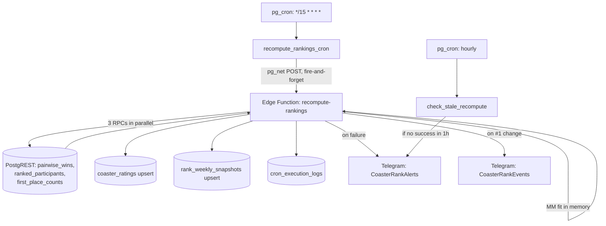

# Scale

How the CoasterRank ranking pipeline scales: what it costs today, the math
governing growth, the first bottleneck, and architectural options within our
stack. Companion to [`RANKINGS.md`](RANKINGS.md) (how rankings work) —
this doc is about how they *scale*.

Status: **Production Active Architecture (Updated 2026-09-14)**.
- **§1, §2a, §4, §5 describe historical baseline architecture** (pre-2026-09-13 unpaginated JS fit over PostgREST). Retained as historical benchmarks and failure mode context.
- **§9 & §10 document the current production pipeline**: incremental pair maintenance (`pair_dirty_users`, `user_pairs`, `pair_totals`), warm-started in-DB fitting (`pair_fit_step`), 5-min cron cadence, and Cloudflare Worker edge caching.

## 0. Architecture Overview: End-to-End Data Pipeline

The diagram below illustrates how raw user ranking writes flow through dirty tracking, incremental delta pair maintenance, in-DB Bradley-Terry fitting, and edge CDN delivery.

```mermaid
flowchart TD
    subgraph Client Layer
        UI[User Ranks / CSV Import / Guest Claim]
        SPA[SPA Board View]
    end

    subgraph Supabase Postgres (Database Engine)
        TRG[Statement Trigger on user_rides]
        QUE[(pair_dirty_users Queue)]
        SWP[Hourly Reconciliation Sweep]

        subgraph Incremental Pair Maintenance
            UP[(user_pairs Delta)]
            PT[(pair_totals Aggregates)]
        end

        subgraph In-DB Bradley-Terry Fit
            FIT[pair_fit_step MM Engine\nWarm-Started Iterations]
            RAT[(coaster_ratings Table)]
            VIEW[v_coaster_rankings View]
        end
    end

    subgraph Execution & Monitoring
        CRON[pg_cron: */5 min]
        EDGE[recompute-rankings Edge Function]
        LOGS[(cron_execution_logs)]
        ALERT[Telegram Alerts / Admin Dashboard]
    end

    subgraph CDN Edge Layer
        CF[Cloudflare Worker /api/ranking\n5-min Edge Cache]
    end

    %% Flow Connections
    UI -->|1. Write Rides| TRG
    TRG -->|2. Mark User Dirty| QUE
    SWP -.->|Self-Heal Missed Flags| QUE

    CRON -->|3. Trigger Slot| EDGE
    EDGE -->|4. Claim Batch & Apply Deltas| QUE
    QUE --> UP
    UP -->|5. Delta Upsert| PT

    EDGE -->|6. Run Warm-Start Fit| FIT
    PT --> FIT
    FIT -->|7. Persist Scores| RAT
    RAT --> VIEW

    EDGE -->|8. Log Telemetry| LOGS
    EDGE -.->|Alert on Fail/Parity Drift| ALERT

    VIEW -->|9. Serve Fresh Data| CF
    CF -->|10. Fast Read| SPA
```

## 1. App context (Historical Baseline Architecture)

> **Historical Context (Pre-2026-09-13):** The section below documents the original 15-minute JS fitting architecture before the promotion of the in-DB pipeline (§9).

CoasterRank is a Vite + React + TypeScript SPA (`app/`) on Supabase
(Postgres + Auth + Edge Functions), auto-deployed to Cloudflare Workers.
Rankings are the only scaling-sensitive path: everything else is small-table
CRUD. The board itself reads a cached view; only the recompute job does
work proportional to user data.

Ranking pipeline (Historical 15-minute JS fit cadence):



Key files:

| File | Role |
|------|------|
| `supabase/migrations/20260817170724_bt_recompute_pg_cron.sql` | Original RPCs + cron schedule |
| `supabase/migrations/20260906120000_security_hardening.sql` | Current RPC bodies (V-01: exclude admins/synthetic) |
| `supabase/migrations/20260829011512_stale_recompute_detection.sql` | Current `recompute_rankings_cron` (no pg_net timeout) + stale check |
| `supabase/functions/recompute-rankings/index.ts` | Edge Function: auth → RPCs → MM → upserts → log/alert |
| `packages/bt/src/mm.ts` | Pure-TS MM fit, shared with tests |
| `scripts/src/testride/` | Synthetic-user seeder — the load generator for §7 |

## 2. Relevant computations

### 2a. `pairwise_wins()` — the expensive query (Historical)

> **Historical Context:** `pairwise_wins()` was the primary cost driver under the original JS fit model. In current production, pair aggregation is maintained incrementally via `pair_totals` and fitted directly in Postgres (`pair_fit_step`).

Per-user-normalized pairwise wins (PLAN §5.1). Current body
(`20260906120000`, V-01):

```sql
with eligible_users as (
  select u.id
  from auth.users u
  join public.profiles p on p.id = u.id
  where p.is_admin = false
    and coalesce(u.raw_user_meta_data->>'synthetic', 'false') <> 'true'
    and lower(coalesce(u.email, '')) not like '%@test.coasterrank.dev'
),
ranked as (
  select ur.user_id, ur.coaster_id, ur.rank,
         count(*) over (partition by ur.user_id) as n
  from public.user_rides ur
  join eligible_users eu on eu.id = ur.user_id
  where ur.rank is not null
),
pairs as (
  select a.coaster_id as winner,
         b.coaster_id as loser,
         1.0 / (a.n * (a.n - 1) / 2) as pair_weight
  from ranked a
  join ranked b
    on a.user_id = b.user_id
   and a.coaster_id <> b.coaster_id
   and a.rank < b.rank
)
select winner, loser, sum(pair_weight)::double precision, count(*)
from pairs
group by winner, loser;
```

Cost driver: the self-join emits **one row per ordered pair per user** —
`R = Σ_u n_u(n_u − 1)/2` raw rows (`n_u` = that user's ranked count) —
then hashes/groups them. `O(R)` time and temp space, all inside **one**
PostgREST HTTP call. The two sibling RPCs (`ranked_participants`,
`first_place_counts`) are plain grouped counts — negligible.

### 2b. MM fit — the cheap computation

`packages/bt/src/mm.ts`, `computeRankings()`. Setup aggregates pairs into
sparse per-coaster opponent maps (`O(P)`, `P` = distinct directed pairs),
then iterates the Hunter (2004) fixed point to `ε = 1e-8`, cap 500:

```ts
for (const id of ids) {
  const p = scores.get(id)!
  const numerator = (winsWeight.get(id) ?? 0) + opts.anchorWeight / 2 + opts.l2
  let denominator = opts.l2 + opts.anchorWeight / (p + 1)
  for (const [otherId, n] of opponents.get(id)!) {
    denominator += n / (p + scores.get(otherId)!)
  }
  const updated = Math.max(numerator / denominator, MIN_SCORE)
  // ... max |Δ log score| drives convergence
}
```

Per iteration each directed pair is touched twice (both endpoints'
adjacency), so ~2P relaxations/iter. The anchor (`a = 1`) + L2 (`λ = 0.5`)
strongly condition the problem: dense comparison graphs converge in
~10–30 iterations regardless of scale. Iteration *count* is flat; only
cost *per iteration* grows, linearly in P.

### 2c. Persist + observe (Edge Function)

```ts
const UPSERT_CHUNK = 500                    // coaster_ratings, snapshots
const RPC_MAX_RETRIES = 3                   // PGRST303 + 504-family, exponential 1s/2s/4s + jitter
const RPC_RETRY_JITTER_MS = 250
// Telegram sends: AbortSignal.timeout(5000)
// Per-RPC wall-clock ms + JSON payload bytes → cron_execution_logs.rpc_stats
// Idle-skip: pg_cron no-ops (status='skipped') when recompute_idle_fingerprint()
// matches the last success row; manual triggers always run.
```

Per run, after the 3 parallel RPCs: ~10 **sequential** PostgREST roundtrips
(prev-#1 select, upsert chunks, snapshot upserts, retention delete,
existing-ratings select, stale deletes, new-#1 select, 1–2 name lookups,
log insert). Each is fast, but each is an independent HTTP call through the
API gateway — a fixed ~1s floor and N independent chances to catch a
gateway blip. The pg_cron trigger itself is fire-and-forget
(`perform net.http_post(...)`, default ~5s pg_net wait, response discarded),
so the function must finish on the platform's own budget.

## 3. Measured baseline (prod, 2026-09-09)

```sql
-- scale census (read-only)
SELECT (SELECT count(*) FROM coasters) AS coasters,
       (SELECT count(*) FROM user_rides WHERE rank IS NOT NULL) AS ranked_rides,
       (SELECT count(DISTINCT user_id) FROM user_rides WHERE rank IS NOT NULL) AS ranking_users;
-- per-user list-length distribution
SELECT count(*) AS users, avg(n)::numeric(10,1) AS avg_ranked, max(n) AS max_ranked,
       sum(n*(n-1)/2) AS raw_pair_rows
FROM (SELECT user_id, count(*) AS n FROM user_rides
      WHERE rank IS NOT NULL GROUP BY user_id) s;
```

| Metric | Value |
|---|---|
| Catalog coasters | 1,228 |
| Ranking users | **2** (avg 91.5 ranked each, max 96) |
| Raw pair rows R | 8,301 |
| Distinct pairs P | 5,132 (P/R ≈ 0.62) |
| Coasters rated / run | 99 |
| MM iterations | 12 (converged) |
| Total run duration | 1.2–3.6s at identical workload |

Two things stand out. First, the fixed floor (~1s of roundtrips) dominates:
per-unit compute is in the noise. Second, identical workloads varied 3× run
to run — platform tail latency, not data, rules today.

The same morning supplied the key datum: the 06:30 run died after 6891ms
with a bare `Gateway Timeout`, flanked by successes at 06:15 (1222ms) and
06:45 (1203ms) on the identical 5,132-pair workload — the only error in 7
days. A single awaited call was killed at ~7s by the API gateway on 8k raw
rows. See §4: that is the failure mode scale will make permanent.

## 4. Scaling math (Historical Projections & Observed Walls)

> **Historical Context:** §4 details the theoretical bounds that led to the measured benchmark spike in §9. Under the live in-DB fit architecture, the $O(R)$ JS transfer wall has been eliminated.

Raw rows grow **quadratically in list length, linearly in users**:
`R ≈ U·n̄²/2`. Distinct pairs `P ≈ 0.3–0.6 × R`, capped by the catalog
bound `C(C−1)` (~1.5M directed at C = 1,228); taste concentration (everyone
ranks the same popular rides) pushes toward the low end. Transfer is
~120 bytes/pair-row of JSON.

| n̄ \ U | 100 users | 1,000 users | 10,000 users |
|---|---|---|---|
| 25 | 30k | 300k | 3M |
| 50 | 122k | 1.2M | 12M |
| 100 | 495k | 5M | 50M |
| 250 | 3.1M | 31M | 311M |

(Today: 8.3k. 100 × 100avg ≈ 60× today; 1k × 100 ≈ 600×; the 250-corner is
375×–37,000×. n̄ = 250 is extreme — ranking 250 coasters is hours of UX
effort; realistic n̄ is more like 20–60.)

Projected full-run wall clock (order-of-magnitude; §3-calibrated):

| Scale | SQL agg | Transfer | MM | Total | Verdict |
|---|---|---|---|---|---|
| Today | ms | KB | <100ms | 1–3.5s | ✓ observed |
| 100 × ~50 | ~0.5–2s | ~8MB / ~1s | ~0.1s | ~3–8s | works, tail risk |
| 100 × 100–250 | ~2–15s | ~20–80MB | ~0.2–1s | ~10–40s | intermittent 504s |
| 1,000 × ~100 | tens of s | 60–180MB | ~1–3s | minutes | dead on 15-min cadence |
| 10,000 | minutes+ (hash spill) | 100MB+ | ~2–5s | — | needs redesign |

Upserts/snapshots (≈ rated coasters, hundreds) stay <1s at every scale
until the catalog itself grows ~100×. MM stays a 1–5s sideshow even at 1M
pairs × 20 iterations. **SQL aggregation + pair-payload transfer dominate
by 10–100×.**

## 5. Bottlenecks, ranked

1. **`pairwise_wins()` as a single HTTP request vs the gateway timeout.**
   The binding constraint is *per-request* latency, not total work: one
   call's SQL + JSON serialization must fit in single-digit seconds
   (empirical: killed at 6.9s, §3). It grows `O(U·n²)` — the steepest curve
   in the system. At scale the 06:30 incident stops being transient and
   becomes every run: bare `Gateway Timeout`, missed slot, no self-recovery.
2. **~10 sequential gateway roundtrips per run** (§2c). Independent
   per-call tail risk that grows with nothing — already the dominant cost
   and the likely author of the 06:30 blip.
3. **Full recompute every 15 min regardless of new data.** At scale most
   slots redo identical work; write amplification on `coaster_ratings` /
   snapshots grows with rated coasters for zero new information.
4. **Pair payload via PostgREST JSON.** 12MB is fine; 60–180MB is not —
   memory, serialization time, and timeout exposure all at once.
5. **MM iteration count on disconnected graphs** (distant last). Regional
   user clusters with zero cross-comparisons slow convergence; the anchor +
   L2 still guarantee it, just in more iterations. Only matters after 1–4
   are solved.

## 6. Options within our stack constraints

No new infrastructure assumed (Supabase Postgres + pg_cron/pg_net + Deno
Edge Functions + Cloudflare SPA). Ordered cheap → structural:

1. **Skip idle runs.** ✅ Shipped: if `recompute_idle_fingerprint()` (max eligible-ranked change ts + ranked count — count catches DELETEs, which leave no timestamp) matches the last success row's fingerprint, pg_cron slots log `skipped` before touching the RPCs. Manual triggers always run. `check_stale_recompute` treats skips as healthy; `last_recomputed_at` only moves on real recomputes.
2. **Harden the long pole.** ✅ Partially shipped: retry-with-backoff on 504 for the aggregate RPCs (3 retries, 1s/2s/4s + jitter; previously PGRST303-only) plus per-RPC ms/bytes into `cron_execution_logs.rpc_stats` (§8 queries can now trend them). **Still open (and now the top prod fix, §9): paginating the pair result via `.range()` — the un-paginated RPC is silently truncated at the PostgREST max-rows cap, so the live board is fitted on a 10k-row prefix of its ~50k pairs.**
3. **Incremental pair maintenance.** A materialized pair table kept fresh by
   a trigger on `user_rides`; recompute reads pre-aggregated rows instead
   of re-joining `O(U·n²)` every 15 min. Turns the per-run cost from
   quadratic-in-lists to linear-in-rated-coasters. **Measured 2026-09-13 (§9): moves per-run SQL cost but not the pair payload — the edge-function memory cliff stays put; pair with the in-DB fit.**
4. **Warm-start MM** from previous scores (12 iters → 2–3) once runs are
   frequent relative to data change. Only pays off combined with 1–3.
5. **Slow the cadence / split the lanes** (1k+ users). Hourly full
   recompute + cheap incremental top-up, or run the fit where the data
   lives (PL/pgSQL or `pg_background`) so no pair payload crosses the
   gateway at all. **Measured 2026-09-13 (§9, b-plpgsql): the in-DB fit works
   and collapses the payload ~60×; per-run aggregation is the remaining wall,
   so combine with §6.3.**
6. **Bound the inputs.** Cap ranked-list length that feeds the fit and/or
   sample pairs per user (the per-user normalization already makes each
   user ~1 unit of influence — sampling preserves that while capping R).

## 7. Validation plan

Don't trust §4 past one significant figure — measure with the seeder we
already have (`scripts/src/testride/`, dry-run by default; never leave
synthetic users in prod):

1. On a staging project, seed `U × n̄` grids (e.g. 50×50, 100×100,
   200×250) and record `pairwise_wins` latency, payload bytes, total run
   duration, and iterations from `cron_execution_logs`.
2. Plot duration vs R; the knee where p95 crosses ~5s is the real wall for
   the current shape.
3. Re-run after each §6 mitigation; promote the option that moves the knee
   past 10× current scale per unit of complexity.

✅ **Executed 2026-09-13** — see §9 for the measured results; the harness
(`scripts/src/bench/`) is permanent and re-runs the identical grid against
any candidate fix.

## 9. Measured load tolerance (2026-09-13 spike)

Full method, environment, and raw data:
[`research/benchmarks/2026-09-pairwise/`](../research/benchmarks/2026-09-pairwise/README.md).
Disposable staging project from the nightly prod dump + migrations; PostgREST
max-rows raised to 1M so nothing truncates; pg_cron disabled; every recompute
manual; grid seeded with bench-*eligible* synthetic users (testride's
`synthetic` marker would be excluded by the eligibility CTE) using the shared-
popularity ride model (P/R ≈ prod's). R measured from the DB, not nominal.

### Baseline (production shape, 50 runs)

| R (raw pair rows) | point | passed | what happens |
|---|---|---|---|
| 61k | 50×50 | 5/5 | run 3.5s, rpc 1.1s, **7.2MB payload** |
| 106k | 60×60 | 1/5 | **HTTP 546 `WORKER_RESOURCE_LIMIT`** — edge-function OOM |
| 253k+ | 80×80 … 200×250 | 0/… | OOM on every run |
| 1.7M+ | 150×150, 200×250 | 0/… | (also) platform statement timeout on the SQL |

The binding wall is **edge-function memory** (the pair JSON loads into the
Deno worker), not the ~7s gateway — that never even gets a chance to fire.
The cliff sits at **~2× today's prod load** (prod R ≈ 50k, 10 ranking users
on 2026-09-13).

### Prod defects found while measuring

1. **The board is fitted on truncated pair data.** PostgREST max-rows caps
   the RPC at 10,000 rows; the true distinct-pair count is ~50k (2026-09-13).
   `pairs` in `cron_execution_logs` reads exactly 10,000 on every prod run —
   the signature went unnoticed because nothing compared rows-returned to
   DB truth. A silently capped aggregate looks like a successful run.
2. **Prod sits between knee and cliff already**: rpc 4.5–12.3s, totals
   7.7–26.4s, and two gateway-504 errors on 2026-09-12 (§3's 06:30 incident
   pattern, recurring).

### Fix + guardrails

- **Immediate**: paginate the pair RPC in the Edge Function (`.range()` loop
  until exhausted — truncation becomes structurally impossible) and re-verify
  with the DB-truth check. PR through CI (functions deploy is CI-run).
- **Never-again guardrails**: the recompute should log `pairs` alongside a
  DB-truth count (or drain pages so the cap can't hide); the health-check
  script can assert `logged pairs == SQL truth` weekly; and this harness's
  `bench parity` command pins score equality between any refactor of the fit
  and the reference MM.
- **Structural (measured below)**: one of the two prototypes.

### Variant results (same grid, same seeds)

| variant | reliable through R | cliff | wall |
|---|---|---|---|
| baseline | 61k | 106k | edge-function OOM (payload ~12MB) |
| a-dirty (§6.3: trigger-maintained pair table) | 61k | 106k | **unchanged** — payload identical, memory wall untouched |
| b-plpgsql (agg + MM in-DB, warm-start) | **495k** | 1.7M | aggregation statement vs ~8s platform statement timeout |

- **a-dirty** moves per-run SQL cost (O(join) → O(read) + incremental
  maintenance) but ships the same pair payload — the OOM cliff doesn't move.
- **b-plpgsql** collapses the payload to board-size (~0.1MB vs 7.2MB) and
  survives 4× past the baseline cliff; warm-start (§6.4) converges the
  steady-state in 1–3 iterations (cold fits after a board rebuild run 80–160
  iterations across resumable `fit_step` calls). Its wall: the per-run pair
  aggregation statement outgrows the ~8s per-statement timeout at R ≈ 1.7M.
- **a+b combined removes both walls** (no per-run aggregation, no payload
  transfer) and is the recommended promotion shape; measured separately here,
  the combination is their union of wins. Bulk-import bursts add nothing at
  survivable scales (cold stats at 50×50 measured within noise of baseline).

### Growth simulation (accumulation + churn, 2026-09-13)

The grid measures full rebuilds; real growth is incremental — users
accumulate and each cron slot processes only the **dirty set** (new users +
existing users who edited rankings). `bench churn` walks epochs of
`{totalUsers, editors}` from 10 users toward 1,000 (uniform 50-ride lists,
plus bulk-import burst users with 220 rides at 100/350/750), keeping state
between epochs, two runs per epoch (apply = after changes, idle = unchanged
floor). Raw data: `../research/benchmarks/2026-09-pairwise/` (churn section in
RESULTS.md).

| variant | died at | wall |
|---|---|---|
| baseline | 100 users (+burst; R ≈ 147k) | payload OOM — nothing about churn changes it |
| ab-combined | 350–500 users (R ≈ 475–660k) | `bench_fit_agg` O(R) scan vs ~8s statement timeout |

Two-axis break points measured for ab-combined:

- **Dirty axis**: one `bench_fit_maintain` call exceeded the statement
  timeout at ~200 dirty users in a single epoch; 100+ dirty users made apply
  slow (60–80s) but survivable. Refinement: batch the maintain call across
  RPCs (the same adaptive pattern `fit_step` already uses).
- **Total axis**: the per-run O(R) aggregation scan + the warm fit's O(P)
  iteration set the floor — idle runs grew 1.7s (R=12k) → 9.2s (R=268k), and
  `fit_agg` broke at R ≈ 475k. Refinements: two-level incremental pair
  totals (maintain the global aggregate by delta, never re-scan) and
  per-coaster-batch fit iterations.
- **Bloat**: delete+rewrite of dirty users' pair rows degrades the
  aggregation between vacuums — later epochs measured slower than fresh
  ones. A production promotion needs an autovacuum story for the pair table.

Verdict: the combined shape rides ~4–5× further up the growth ladder than
the current shape, and its breaks are refinable statement boundaries rather
than hard memory walls. Its steady-state floor is the warm 1–3-iteration
in-DB fit plus a board-sized payload.

**Promotion spec:** the epic-ready design — app-set dirty flags (same
transaction as ride writes) + hourly reconciliation sweep instead of DB
triggers (trigger-based pair maintenance is a measured trap: O(n²) write
amplification, bloat, lock contention), dedicated dirty-state table,
two-level delta-maintained pair totals with batch temp-table aggregation,
`SET LOCAL temp_buffers` in the fit functions, single-writer deadlock
avoidance, and a vacuum strategy for the pair tables — is
[`decisions/2026-09-incremental-ranking.md`](decisions/2026-09-incremental-ranking.md).
The trigger-based variant SQL in `scripts/src/bench/sql/` is the measured
prototype, deliberately superseded by that spec for production.
**Shipped 2026-09-13** (shadow rollout; per-run floor + dirty-queue timing
are first-class observables — see RANKINGS.md "Pair pipeline: per-run floor
& dirty-queue timing" and PLAN §5.6): one deviation from the spec — the
dirty flags are set by a tiny flag-only *statement* trigger on `user_rides`
(transition tables, O(1) distinct rows per ride-write statement) instead of
per-path app code, which makes the marking atomic with every write path
(RPCs, CLI, cascades) while still avoiding the measured O(n²) pair-mutation
trigger trap §1 rejects; the reconciliation sweep is unchanged.


## 8. Ops queries

```sql
-- scale census + list-length distribution (see §3)
-- last runs with duration trend (rpc_stats holds per-RPC ms/bytes)
SELECT created_at, status, duration_ms, pairs, updated, iterations, error_message,
       rpc_stats->'pairwise_wins' AS pairwise
FROM cron_execution_logs ORDER BY created_at DESC LIMIT 15;
-- failures in the last day
SELECT created_at, error_message, duration_ms, trigger_source
FROM cron_execution_logs
WHERE status = 'error' AND created_at > now() - interval '1 day'
ORDER BY created_at DESC;
-- average duration per hour (watch the trend as users grow)
SELECT date_trunc('hour', created_at), AVG(duration_ms), COUNT(*)
FROM cron_execution_logs
WHERE status = 'success' AND created_at > now() - interval '24 hours'
GROUP BY 1 ORDER BY 1 DESC;
-- pair pipeline: per-run floor + dirty-queue timing (RANKINGS.md has the full guide)
SELECT created_at, status, duration_ms,
       rpc_stats->'fit'->>'dirty_processed'  AS dirty,
       rpc_stats->'fit'->>'dirty_remaining'  AS left_,
       rpc_stats->'fit'->>'maintain_ms'      AS maintain_ms,
       rpc_stats->'fit'->>'step_ms'          AS fit_ms,
       rpc_stats->'fit'->>'db_pairs'         AS db_pairs,
       rpc_stats->'parity'->>'max_log_delta' AS parity_delta
FROM cron_execution_logs ORDER BY created_at DESC LIMIT 15;
-- live dirty queue (healthy steady state: depth 0)
SELECT count(*) AS depth, min(marked_at) AS oldest_marked FROM pair_dirty_users;
-- pair-layer growth + bloat watch (vacuum is a first-class concern, PROMOTION §3)
SELECT relname, n_live_tup, n_dead_tup, last_autovacuum, last_analyze
FROM pg_stat_user_tables
WHERE relname IN ('user_pairs', 'pair_totals', 'pair_dirty_users', 'pair_user_state');
```
