# Design Document: Track A Data Quality Pipeline

## Overview

Track A is a one-time, pre-launch data quality pipeline for the CoasterRank coaster catalog (~1,087 records). It runs entirely in the `scripts/` subproject against the production Supabase instance via the service-role key and produces no user-visible features.

The fixed LLM model is **Qwen3.8-27B** — no model selection step.

The pipeline phases run in this order (Phase 7 can run in parallel with Phases 1–6):

```
    Phase 0 (migration)
      → Phase 1 (normalize coaster names)
      → Phase 4 (coaster dupe candidates — requires Phase 3 done)
      → Phase 5 (LLM adjudication)
      → Phase 6 (merge review)
      → Phase 8 (coverage QA)
    
    Phase 7 (status triage) ─────────────────── parallel to Phases 1–6
    ```
    
    **Critical sequencing constraint:** Coaster candidate generation (Phase 4) uses same-park blocking. That blocking is only reliable after duplicate manufacturers have been collapsed and `coasters.manufacturer_id` re-pointed (Phase 3). Run Phase 3 to completion before Phase 4.
    
Each phase produces durable output that feeds the next, making the pipeline restartable at any phase boundary.

---

## Architecture

### High-Level Data Flow

```mermaid
flowchart TD
    subgraph DB["Supabase (production)"]
        C[(coasters)]
        P[(parks)]
        MFR[(manufacturers)]
        ML[(coaster_merge_log)]
        DC[(coaster_dupe_candidates)]
        PDC[(park_dupe_candidates)]
    end

    subgraph scripts["scripts/ package (Node/TypeScript, tsx runner)"]
        direction LR

        subgraph llm["scripts/src/llm/"]
            client["client.ts\n(lmStudio, MODEL_ID=qwen3.8-27b)"]
            prompts["prompts.ts\n(NORMALIZATION_SYSTEM_PROMPT\nADJUDICATION_SYSTEM_PROMPT)"]
            tasks["tasks.ts\n(normalizeOne, normalizeBatch\nadjudicateOne + Zod schemas)"]
        end

        subgraph db_["scripts/src/db/"]
            dbclient["client.ts\n(supabaseAdmin)"]
        end

        subgraph pipeline["scripts/src/"]
            p1["normalize-names.ts\nPhase 1"]
            p2a["generate-park-candidates.ts\nPhase 2"]
            p4["generate-dupe-candidates.ts\nPhase 4"]
            p5["adjudicate-dupes.ts\nPhase 5"]
            p7["triage-status.ts\nPhase 7"]
        end
    
        subgraph review_["scripts/src/review/"]
            p2b["review-parks.ts\nPhase 2"]
            p6["review-dupes.ts\nPhase 6"]
        end

        subgraph qa["scripts/src/qa/"]
            coverage["check-golden-ticket-coverage.ts\nPhase 8"]
            fetch_new["fetch-new-openings.ts\nPhase 8 ETL"]
            coverage_new["check-new-openings-coverage.ts\nPhase 8 check"]
        end

        subgraph fixtures["scripts/qa/fixtures/"]
            fx2["golden-ticket-2025.json\n100 GT Award entries"]
            fx3["new-openings-2021-2026.json\nWikidata ETL entries"]
        end

        subgraph output["scripts/output/"]
            rpt["status-triage-<ts>.json\nPhase 7 triage report"]
        end
    end

    subgraph LMStudio["LM Studio (localhost:1234/v1)"]
        LLM["Qwen3.8-27B"]
    end

    subgraph migration["supabase/migrations/"]
        mig["<timestamp>_coaster_review_metadata_and_dedup_staging.sql\nPhase 0"]
    end

    mig -->|merge to main → CI supabase db push| DB
    client -->|OpenAI-compatible API| LLM
    LLM --> tasks
    tasks --> p1
    tasks --> p5
    dbclient --> p1
    dbclient --> p2a
    dbclient --> p2b
    dbclient --> p3a
    dbclient --> p3b
    dbclient --> p4
    dbclient --> p5
    dbclient --> p6
    dbclient --> p7
    dbclient --> coverage
    p1 --> C
    p2a --> PDC
    p2b --> P
    p2b --> C
    p3a --> MDC
    p3b --> MFR
    p3b --> C
    p4 --> DC
    p5 --> DC
    p6 --> C
    p6 --> ML
    p6 --> DC
    p7 --> C
    coverage --> C
    fx2 --> coverage
    p7 --> rpt
```



### Runtime Sequence per Phase

| Phase | Trigger | Reads | Writes |
|---|---|---|---|
| 0 | PR merged to `main` → CI runs `supabase db push` automatically | — | Schema changes to Supabase |
| 1 | `npm run normalize-names -- --apply` | `coasters` (active rows) | `coasters` (name, review_state, needs_review_reason) |
| 2 | `npm run generate-park-candidates -- --apply` then `npm run adjudicate-parks -- --apply` then `npm run review-parks` | `parks` | `park_dupe_candidates`, `parks` (delete), `coasters` (park_id repoint) |
| 3 | `npm run generate-dupe-candidates -- --apply` | `coasters` | `coaster_dupe_candidates` |
| 4 | `npm run adjudicate-dupes -- --apply` | `coaster_dupe_candidates`, `coasters` | `coaster_dupe_candidates` (verdict fields) |
| 5 | `npm run review-dupes` | `coaster_dupe_candidates`, `coasters` | `coasters` (delete), `coaster_merge_log`, `coaster_dupe_candidates` |
| 5 | `npm run triage-status -- --apply --input <path>` | `coasters`, input JSON | `coasters` (status fields) |
| 6 | `npm run check-coverage` | `coasters`, `golden-ticket-2025.json` | nothing |

---

## Components and Interfaces

### Module Layout

```
scripts/
  package.json                         ← extended with openai, zod, @supabase/supabase-js (pinned)
  tsconfig.json                        ← include: ["./src/**/*.ts", "./*.ts"], strict: true
  import-coasters.ts                   ← existing, unchanged

  src/
    llm/
      client.ts                        ← lmStudio export, MODEL_ID = "qwen3.8-27b"
      prompts.ts                       ← NORMALIZATION_SYSTEM_PROMPT, ADJUDICATION_SYSTEM_PROMPT
      tasks.ts                         ← normalizeOne, normalizeBatch, adjudicateOne + Zod schemas
    db/
      client.ts                        ← supabaseAdmin export (env var guard)

    normalize-names.ts                 ← Phase 1 entry point
    generate-park-candidates.ts        ← Phase 2 candidate generation
    adjudicate-parks.ts                ← Phase 2 LLM adjudication
    generate-manufacturer-candidates.ts ← Phase 3 candidate generation
    adjudicate-manufacturers.ts        ← Phase 3 LLM adjudication
    generate-dupe-candidates.ts        ← Phase 4 entry point
    adjudicate-dupes.ts                ← Phase 5 entry point
    triage-status.ts                   ← Phase 7 entry point

    review/
      review-parks.ts                  ← Phase 2 interactive CLI
      review-manufacturers.ts          ← Phase 3 interactive CLI
      review-dupes.ts                  ← Phase 6 interactive CLI

    qa/
      check-golden-ticket-coverage.ts  ← Phase 8 coverage check
      fetch-new-openings.ts            ← Phase 8 Wikidata ETL fetcher
      check-new-openings-coverage.ts   ← Phase 8 new openings check

  qa/
    fixtures/
      golden-ticket-2025.json          ← 100 GT Award entries (50 steel, 50 wood)
      new-openings-2021-2026.json      ← Wikidata ETL openings data

  output/                              ← created by triage-status if absent
    status-triage-<YYYYMMDDTHHmmssZ>.json
```

### `scripts/src/llm/client.ts`

```typescript
import OpenAI from "openai";

// Fixed model — no env var or runtime guard needed.
// Qwen3.8-27B is the chosen model for all pipeline tasks.
export const MODEL_ID = "qwen3.8-27b";

export const lmStudio = new OpenAI({
  baseURL: "http://localhost:1234/v1",
  apiKey: "lm-studio",
});
```

### `scripts/src/db/client.ts`

```typescript
import dotenv from "dotenv";
import { dirname, join } from "node:path";
import { fileURLToPath } from "node:url";
import { createClient } from "@supabase/supabase-js";

dotenv.config({ path: join(dirname(fileURLToPath(import.meta.url)), "../../..", ".env") });

const url = process.env.SUPABASE_URL;
const key = process.env.SUPABASE_SERVICE_ROLE_KEY;

if (!url || !key) {
  process.stderr.write("Error: SUPABASE_URL and SUPABASE_SERVICE_ROLE_KEY must both be set\n");
  process.exit(1);
}

export const supabaseAdmin = createClient(url, key, {
  auth: { persistSession: false },
});
```

### `scripts/src/llm/tasks.ts` — Key Signatures

```typescript
// --- Zod schemas ---
export const NormalizationResult = z.object({
  coaster_id:   z.string(),
  cleaned_name: z.string(),
  issue:        z.enum(["park_name_embedded", "truncated", "abbreviation", "none"]),
  confidence:   z.number().min(0).max(1),
  reasoning:    z.string().max(200),
});
export type NormalizationResult = z.infer<typeof NormalizationResult>;

export const NormalizationBatch = z.array(NormalizationResult);
export type NormalizationBatch = z.infer<typeof NormalizationBatch>;

export const AdjudicationResult = z.object({
  pair_id:    z.string(),
  verdict:    z.enum(["duplicate", "not_duplicate", "needs_human"]),
  confidence: z.number().min(0).max(1),
  reasoning:  z.string().max(200),
});
export type AdjudicationResult = z.infer<typeof AdjudicationResult>;

// --- Input types ---
export type NormalizeInput = { coaster_id: string; name: string; park_name: string };
export type AdjudicateInput = {
  pair_id: string;
  coaster_a: {
    coaster_id: string; name: string; park_name: string;
    manufacturer: string | null; opening_date: string | null; height_m: number | null;
  };
  coaster_b: {
    coaster_id: string; name: string; park_name: string;
    manufacturer: string | null; opening_date: string | null; height_m: number | null;
  };
  similarity: number;
};

// --- Task functions ---

/** Normalizes a single coaster record. Throws if validation fails after one retry. */
export async function normalizeOne(input: NormalizeInput): Promise<NormalizationResult>;

/**
 * Normalizes a batch of coaster records in a single LLM call.
 * Validates each item individually; throws if the batch fails after one retry.
 * The caller (normalize-names.ts) catches the throw and applies the needs_review fallback.
 */
export async function normalizeBatch(records: NormalizeInput[]): Promise<NormalizationBatch>;

/** Adjudicates a single candidate pair. Throws if validation fails after one retry. */
export async function adjudicateOne(input: AdjudicateInput): Promise<AdjudicationResult>;
```

### Retry Helper (internal to `tasks.ts`)

The retry logic is extracted into a private `callWithRetry` helper shared by all three task functions:

```typescript
async function callWithRetry<T>(
  messages: OpenAI.Chat.ChatCompletionMessageParam[],
  schema: z.ZodType<T>,
): Promise<T> {
  const attempt = async (msgs: OpenAI.Chat.ChatCompletionMessageParam[]) => {
    const completion = await lmStudio.chat.completions.create({
      model: MODEL_ID,
      temperature: 0,
      messages: msgs,
      response_format: { type: "json_object" },
    });
    return completion.choices[0]?.message.content ?? "{}";
  };

  const rawFirst = await attempt(messages);
  const firstParse = schema.safeParse(JSON.parse(rawFirst));
  if (firstParse.success) return firstParse.data;

  // Log and retry once
  process.stderr.write(`[llm] Zod validation failed (attempt 1): ${firstParse.error.message}\n`);
  process.stderr.write(`[llm] Raw response: ${rawFirst}\n`);

  const retryMessages: OpenAI.Chat.ChatCompletionMessageParam[] = [
    ...messages,
    { role: "assistant", content: rawFirst },
    {
      role: "user",
      content:
        "Your response did not match the required JSON schema. " +
        "Output ONLY valid JSON matching the schema. No prose, no markdown.",
    },
  ];
  const rawRetry = await attempt(retryMessages);
  const retryParse = schema.safeParse(JSON.parse(rawRetry));
  if (retryParse.success) return retryParse.data;

  process.stderr.write(`[llm] Zod validation failed (attempt 2): ${retryParse.error.message}\n`);
  process.stderr.write(`[llm] Raw response: ${rawRetry}\n`);
  throw new Error(`LLM response failed Zod validation after retry`);
}
```

### `scripts/src/review/review-dupes.ts` — CLI Interaction Model

`review-dupes` is a keystroke-driven batch CLI. It processes all unresolved candidates in priority order, presenting each pair and reading a single keypress (`y` = confirm merge, `n` = reject, `s` = skip) via `process.stdin` in raw mode. On confirmation it prompts for a reason string before committing.

```
Candidate 1 of 47  [verdict: duplicate | confidence: 0.92 | similarity: 0.87]
─────────────────────────────────────────────────────────────────────────────
  A: "Fury 325"     @ Carowinds (Intamin / 2015-03-27 / 94m)
  B: "Fury 325 "    @ Carowinds (null / 2015 / null)
  LLM: "Identical name and park; B has less data — classic dual-import artifact."
─────────────────────────────────────────────────────────────────────────────
[y] Confirm merge (A=canonical, B=duplicate)  [n] Reject  [s] Skip
> y
Reason: duplicate import from open-csv (extra trailing space)
✓ Merge applied. Deleted coaster B, logged audit record.
```

Priority ordering (applied in-memory after fetching all unresolved candidates):

```typescript
function sortCandidates(rows: DupeCandidate[]): DupeCandidate[] {
  return rows.sort((a, b) => {
    const aHigh = a.verdict === "duplicate" && (a.verdict_confidence ?? 0) >= 0.85;
    const bHigh = b.verdict === "duplicate" && (b.verdict_confidence ?? 0) >= 0.85;
    if (aHigh && !bHigh) return -1;
    if (!aHigh && bHigh) return 1;
    if (aHigh && bHigh) {
      const confDiff = (b.verdict_confidence ?? 0) - (a.verdict_confidence ?? 0);
      if (confDiff !== 0) return confDiff;
      return a.id < b.id ? -1 : 1;
    }
    const simDiff = b.similarity - a.similarity;
    if (simDiff !== 0) return simDiff;
    return a.id < b.id ? -1 : 1;
  });
}
```

Merge flow (abridged — full transaction via DB function):

```typescript
async function applyMerge(
  duplicateId: string,
  canonicalId: string,
  candidateId: string,
  reason: string,
  mergedBy: string,
): Promise<void> {
  // user_rides guard
  const { count } = await supabaseAdmin
    .from("user_rides")
    .select("*", { count: "exact", head: true })
    .eq("coaster_id", duplicateId);

  if (count && count > 0) {
    const { data: rides } = await supabaseAdmin
      .from("user_rides").select("user_id").eq("coaster_id", duplicateId);
    const userIds = rides?.map((r) => r.user_id) ?? [];
    process.stderr.write(
      `[merge] Aborted: duplicate coaster ${duplicateId} has ${count} user_rides row(s). ` +
      `Affected users: ${userIds.join(", ")}\n`,
    );
    await supabaseAdmin
      .from("coaster_dupe_candidates")
      .update({ verdict: "needs_human", verdict_reasoning: "user_rides_present" })
      .eq("id", candidateId);
    return;
  }

  // Atomic merge via DB function (see Data Models for SQL)
  const { error } = await supabaseAdmin.rpc("apply_coaster_merge", {
    p_duplicate_id: duplicateId,
    p_canonical_id: canonicalId,
    p_candidate_id: candidateId,
    p_reason:       reason,
    p_merged_by:    mergedBy,
  });

  if (error) {
    process.stderr.write(`[merge] Transaction failed: ${error.message}\n`);
  }
}
```

---

## Data Models

### Phase 0 Migration SQL

```sql
-- supabase/migrations/<timestamp>_coaster_review_metadata_and_dedup_staging.sql
-- Created via: supabase migration new coaster_review_metadata_and_dedup_staging
-- Applied via: PR → merge to main → CI supabase db push  (never run db push locally)

-- 1. Coasters: review metadata columns (no rcdb_url — no pipeline task populates it)
alter table public.coasters
  add column if not exists last_verified_at    timestamptz,
  add column if not exists confidence          numeric check (confidence between 0 and 1),
  add column if not exists review_state        text not null default 'active'
    check (review_state in ('active', 'needs_review', 'possibly_duplicate', 'possibly_outdated', 'archived')),
  add column if not exists needs_review_reason text;

-- 2. pg_trgm extension and trigram indexes (coasters, parks, manufacturers)
create extension if not exists pg_trgm;
create index if not exists coasters_name_trgm_idx
  on public.coasters using gin (name gin_trgm_ops);
create index if not exists parks_name_trgm_idx
  on public.parks using gin (name gin_trgm_ops);
create index if not exists manufacturers_name_trgm_idx
  on public.manufacturers using gin (name gin_trgm_ops);

-- 3. Coaster merge audit trail
create table if not exists public.coaster_merge_log (
  id                   uuid primary key default gen_random_uuid(),
  duplicate_coaster_id uuid not null,
  -- Note: no FK on duplicate_coaster_id — the referenced row will be deleted;
  -- this column is purely an audit record of what was removed.
  canonical_coaster_id uuid not null references public.coasters (id),
  merged_by            text,
  reason               text,
  created_at           timestamptz not null default now()
);

-- 4. Coaster duplicate candidate staging
create table if not exists public.coaster_dupe_candidates (
  id                  uuid primary key default gen_random_uuid(),
  coaster_a_id        uuid not null references public.coasters (id),
  coaster_b_id        uuid not null references public.coasters (id),
  similarity          numeric not null check (similarity between 0 and 1),
  match_basis         text not null,
  verdict             text,
  verdict_confidence  numeric check (verdict_confidence between 0 and 1),
  verdict_reasoning   text,
  resolved            boolean not null default false,
  reviewed_by         text,
  created_at          timestamptz not null default now(),
  constraint coaster_dupe_candidates_pair_unique unique (coaster_a_id, coaster_b_id)
);

-- 5. Park duplicate candidate staging
create table if not exists public.park_dupe_candidates (
  id           uuid primary key default gen_random_uuid(),
  park_a_id    uuid not null references public.parks (id),
  park_b_id    uuid not null references public.parks (id),
  similarity   numeric not null check (similarity between 0 and 1),
  verdict      text,
  verdict_reasoning text,
  resolved     boolean not null default false,
  reviewed_by  text,
  created_at   timestamptz not null default now(),
  constraint park_dupe_candidates_pair_unique unique (park_a_id, park_b_id)
);

-- 6. Manufacturer duplicate candidate staging
create table if not exists public.manufacturer_dupe_candidates (
  id                  uuid primary key default gen_random_uuid(),
  manufacturer_a_id   uuid not null references public.manufacturers (id),
  manufacturer_b_id   uuid not null references public.manufacturers (id),
  similarity          numeric not null check (similarity between 0 and 1),
  verdict             text,
  verdict_reasoning   text,
  resolved            boolean not null default false,
  reviewed_by         text,
  created_at          timestamptz not null default now(),
  constraint manufacturer_dupe_candidates_pair_unique unique (manufacturer_a_id, manufacturer_b_id)
);

-- 7. RLS for all four new tables:
--    - No access for anon or authenticated (these are internal pipeline tables)
--    - Admin-only SELECT policy via is_admin()
--    - service_role bypasses RLS naturally (used by all pipeline scripts)

alter table public.coaster_merge_log         enable row level security;
alter table public.coaster_dupe_candidates   enable row level security;
alter table public.park_dupe_candidates      enable row level security;
alter table public.manufacturer_dupe_candidates enable row level security;

create policy "coaster_merge_log admin select"
  on public.coaster_merge_log for select
  using (public.is_admin());

create policy "coaster_dupe_candidates admin select"
  on public.coaster_dupe_candidates for select
  using (public.is_admin());

create policy "park_dupe_candidates admin select"
  on public.park_dupe_candidates for select
  using (public.is_admin());

create policy "manufacturer_dupe_candidates admin select"
  on public.manufacturer_dupe_candidates for select
  using (public.is_admin());

-- Grant SELECT to authenticated so the admin policy can fire via PostgREST;
-- anon gets nothing. service_role bypasses RLS.
grant select on public.coaster_merge_log           to authenticated;
grant select on public.coaster_dupe_candidates     to authenticated;
grant select on public.park_dupe_candidates        to authenticated;
grant select on public.manufacturer_dupe_candidates to authenticated;

-- 8. Mark legacy import records for review
update public.coasters
  set review_state = 'needs_review',
      confidence   = 0.3
where source = 'open-csv';

-- 9. Atomic coaster merge helper (used by review-dupes CLI via supabaseAdmin.rpc)
create or replace function public.apply_coaster_merge(
  p_duplicate_id  uuid,
  p_canonical_id  uuid,
  p_candidate_id  uuid,
  p_reason        text,
  p_merged_by     text
)
returns void
language plpgsql
security definer
set search_path = public
as $$
begin
  delete from public.coasters where id = p_duplicate_id;

  insert into public.coaster_merge_log (
    duplicate_coaster_id, canonical_coaster_id, merged_by, reason
  ) values (
    p_duplicate_id, p_canonical_id, p_merged_by, p_reason
  );

  update public.coaster_dupe_candidates
    set resolved = true
  where id = p_candidate_id;
end;
$$;

revoke execute on function public.apply_coaster_merge(uuid, uuid, uuid, text, text)
  from public, anon, authenticated;
grant execute on function public.apply_coaster_merge(uuid, uuid, uuid, text, text)
  to service_role;
```

**Note on park/manufacturer merges:** These are handled directly in the review CLI scripts via supabaseAdmin calls inside a Supabase transaction (using a `BEGIN`/`COMMIT` via the `pg` driver or a DB function if preferred). They don't need a separate `apply_park_merge` DB function because the FK re-pointing is straightforward (`UPDATE coasters SET park_id = $canonical WHERE park_id = $duplicate`) and the scripts already have service_role access.

### Phase 3 Candidate Generation SQL

Executed from `generate-dupe-candidates.ts` via direct Postgres (using the `pg` driver that's already in `scripts/package.json`) or via Supabase RPC:

```sql
-- Pass 1: high-confidence same-park candidates (word_similarity > 0.7)
insert into public.coaster_dupe_candidates
  (coaster_a_id, coaster_b_id, similarity, match_basis)
select
  a.id,
  b.id,
  word_similarity(a.name, b.name),
  'same_park'
from public.coasters a
join public.coasters b
  on a.park_id = b.park_id
 and a.id < b.id
where word_similarity(a.name, b.name) > 0.7
on conflict (coaster_a_id, coaster_b_id) do nothing;

-- Pass 2: wider recall sweep (word_similarity between 0.45 and 0.7, same park)
insert into public.coaster_dupe_candidates
  (coaster_a_id, coaster_b_id, similarity, match_basis)
select
  a.id,
  b.id,
  word_similarity(a.name, b.name),
  'same_park'
from public.coasters a
join public.coasters b
  on a.park_id = b.park_id
 and a.id < b.id
where word_similarity(a.name, b.name) between 0.45 and 0.7
on conflict (coaster_a_id, coaster_b_id) do nothing;
```

`word_similarity` is used throughout rather than `similarity` because `similarity` penalizes length differences harshly, which would miss the "Fury" vs. "Fury 325" (truncated-name) case this pass is specifically designed to catch.

### LLM Prompt Text

The full prompt text is defined verbatim in `scripts/src/llm/prompts.ts`. The content matches the plan document exactly:

**`NORMALIZATION_SYSTEM_PROMPT`** instructs the model to classify each coaster name as `park_name_embedded`, `truncated`, `abbreviation`, or `none`, return a `cleaned_name`, and output a JSON array. Key rules embedded in the prompt: only fix formatting, never change the referenced coaster, classify as `none` when uncertain rather than guessing.

**`ADJUDICATION_SYSTEM_PROMPT`** instructs the model to decide whether two records represent the same physical roller coaster. Key rules: base verdict only on provided fields (no outside knowledge), same-name coasters at different parks are usually not duplicates, output `needs_human` rather than guessing when uncertain. **An explicit additional rule is included in the prompt: null fields on one side of a pair are not evidence that the records describe different coasters — they simply mean one record has less data. When null fields reduce confidence but name and park match strongly, prefer `needs_human` over `not_duplicate`.**

The same adjudication prompt is used for park and manufacturer deduplication, with the field set adapted (park: `name`, `country`, `region`, `city`; manufacturer: `name`, `country`). Since the datasets are small, every candidate pair is reviewed by a human regardless of LLM confidence — the LLM verdict is used for triage ordering only, not as an auto-routing gate.

Both prompts include three worked examples each (as shown in the plan document). The full text is not repeated here — the canonical version lives in `prompts.ts`.

### Fixture Schemas

```typescript
// scripts/qa/fixtures/golden-ticket-2025.json — entry shape
type GTEntry = {
  rank:     number;            // 1-based within category
  category: "steel" | "wood";
  name:     string;
  park:     string;
  country:  string;
};

// scripts/qa/fixtures/new-openings-2021-2026.json — entry shape
type NewOpeningEntry = {
  year:         number;
  name:         string;
  park:         string;
  country:      string;        // 2-letter ISO code
  manufacturer?: string;       // optional enrichment
  height?:      number;        // optional enrichment (meters)
};
```

### Updated `scripts/package.json` Scripts Section

```json
{
  "scripts": {
    "import-coasters":                "tsx import-coasters.ts",
    "typecheck":                      "tsc --noEmit",
    "normalize-names":                "tsx src/normalize-names.ts",
    "generate-park-candidates":       "tsx src/generate-park-candidates.ts",
    "adjudicate-parks":               "tsx src/adjudicate-parks.ts",
    "review-parks":                   "tsx src/review/review-parks.ts",
    "generate-manufacturer-candidates": "tsx src/generate-manufacturer-candidates.ts",
    "adjudicate-manufacturers":       "tsx src/adjudicate-manufacturers.ts",
    "review-manufacturers":           "tsx src/review/review-manufacturers.ts",
    "generate-dupe-candidates":       "tsx src/generate-dupe-candidates.ts",
    "adjudicate-dupes":               "tsx src/adjudicate-dupes.ts",
    "review-dupes":                   "tsx src/review/review-dupes.ts",
    "triage-status":                  "tsx src/triage-status.ts",
    "check-coverage":                 "tsx src/qa/check-golden-ticket-coverage.ts",
    "fetch-new-openings":             "tsx src/qa/fetch-new-openings.ts",
    "check-new-openings":             "tsx src/qa/check-new-openings-coverage.ts",
    "test":                           "vitest --run",
    "test:watch":                     "vitest"
  }
}
```

---

## Correctness Properties

### Property 1: Zod validation is the only gate between LLM output and database writes

*For any* JSON string (valid or malformed), parsing it through `NormalizationResult.parse` or `AdjudicationResult.parse` either succeeds with a fully-typed result or throws — there is no code path that returns a partially-typed object with unvalidated fields.

**Validates: Requirements 3.1, 3.6**

### Property 2: Retry-then-throw on double parse failure

*For any* LLM response that fails Zod validation, `callWithRetry` calls the LLM model function exactly twice before throwing, regardless of what the second response contains.

**Validates: Requirements 3.2**

### Property 3: Normalization batch fallback marks all records

*For any* batch of N records (N ≥ 1) where `normalizeBatch` throws (double Zod failure), the caller's fallback logic marks all N records with `review_state = 'needs_review'` and `needs_review_reason = 'llm_parse_failure'` — the count of marked records equals the count of input records in the batch.

**Validates: Requirements 3.3**

### Property 4: Adjudication fallback sets the correct needs_human fields

*For any* candidate pair where `adjudicateOne` throws (double Zod failure), the fallback writes exactly `verdict = 'needs_human'`, `verdict_confidence = null`, and `verdict_reasoning = 'llm_parse_failure'` — no other field values are acceptable as the fallback.

**Validates: Requirements 3.4**

### Property 5: Normalization Zod schema accepts valid objects and rejects invalid ones

*For any* object where `confidence` is in [0, 1], `issue` is one of the four enum values, and `reasoning` is at most 200 characters, `NormalizationResult.parse` succeeds. *For any* object that violates any of these constraints (confidence outside [0, 1], unknown issue value, reasoning exceeds 200 chars, missing required field), `NormalizationResult.parse` throws.

**Validates: Requirements 12.6**

### Property 6: Adjudication Zod schema accepts valid objects and rejects invalid ones

*For any* object where `confidence` is in [0, 1], `verdict` is one of the three enum values, and `reasoning` is at most 200 characters, `AdjudicationResult.parse` succeeds. *For any* object that violates any of these constraints, `AdjudicationResult.parse` throws.

**Validates: Requirements 12.7**

### Property 7: review_state constraint rejects out-of-range values

*For any* string that is not one of `{'active', 'needs_review', 'possibly_duplicate', 'possibly_outdated', 'archived'}`, the database CHECK constraint on `coasters.review_state` rejects the INSERT or UPDATE.

**Validates: Requirements 1.2**

### Property 8: verdict_confidence constraint rejects out-of-range values

*For any* numeric value strictly less than 0 or strictly greater than 1, the database CHECK constraint on `coaster_dupe_candidates.verdict_confidence` rejects the INSERT or UPDATE.

**Validates: Requirements 1.10**

### Property 9: Normalization apply correctly partitions high/low confidence

*For any* set of coasters in `review_state = 'active'` where the LLM returns `issue != 'none'`, after `--apply`: records with `confidence >= 0.7` have `name = cleaned_name` and `needs_review_reason = 'name_normalized'`; records with `confidence < 0.7` have `name` unchanged and `needs_review_reason = 'low_confidence_normalization'`. The two groups are disjoint and together cover all processed `issue != 'none'` records.

**Validates: Requirements 5.3, 5.4**

### Property 10: Normalization is idempotent for already-processed records

*For any* set of coasters where some have `review_state != 'active'`, running `normalize-names --apply` (without `--reprocess`) leaves those records unchanged — their `name`, `review_state`, and `needs_review_reason` are identical before and after the run.

**Validates: Requirements 5.6**

### Property 11: Normalization summary counts are mutually exclusive and collectively exhaustive

*For any* input batch of N records, the six summary counts (total, `issue=none`, skipped/already-processed, name-updated, state-only-flagged, parse-failures) are non-overlapping and sum to N.

**Validates: Requirements 5.8**

### Property 12: Candidate generation Pass 1 and Pass 2 are disjoint

*For any* set of coasters, after both passes: no pair appears in both Pass 1 and Pass 2. All Pass 1 pairs have `word_similarity > 0.7`; all Pass 2 pairs have `word_similarity` in [0.45, 0.7].

**Validates: Requirements 6.2, 6.3**

### Property 13: Candidate generation is idempotent

*For any* set of coasters, running `generate-dupe-candidates --apply` twice produces the same total candidate count as running it once — no duplicate pairs are inserted on the second run.

**Validates: Requirements 6.6**

### Property 14: Adjudication dry-run writes nothing

*For any* set of unresolved candidate pairs, running `adjudicate-dupes` without `--apply` produces zero database writes while outputting exactly one line per unresolved pair.

**Validates: Requirements 7.6**

### Property 15: Adjudication summary counts are correct

*For any* batch of N unresolved candidate pairs processed by `adjudicate-dupes`, the summary counts for `duplicate + not_duplicate + needs_human + parse_failures` sum to N.

**Validates: Requirements 7.8**

### Property 16: Candidate priority ordering is stable and correct

*For any* set of unresolved candidate pairs, the `sortCandidates` function produces an ordering where all pairs with `verdict = 'duplicate'` and `verdict_confidence >= 0.85` precede all others, within that group ordered by `verdict_confidence` descending then `id` ascending, and remaining pairs ordered by `similarity` descending then `id` ascending.

**Validates: Requirements 8.2**

### Property 17: Merge atomicity — all-or-nothing

*For any* confirmed merge where the database transaction commits: the duplicate coaster row does not exist in `coasters`, a corresponding `coaster_merge_log` row exists, and the candidate has `resolved = true`. If the transaction is rolled back (simulated failure), none of these three changes are visible.

**Validates: Requirements 8.4**

### Property 18: Canonical coaster is never deleted

*For any* confirmed merge, the `canonical_coaster_id` row still exists in `coasters` after the merge commits.

**Validates: Requirements 8.9**

### Property 19: user_rides guard blocks merge for any non-empty ride set

*For any* candidate pair where the duplicate coaster has one or more `user_rides` rows (any count >= 1), the merge is aborted, `verdict = 'needs_human'`, and `verdict_reasoning = 'user_rides_present'`.

**Validates: Requirements 8.8**

### Property 20: Status triage apply only updates entries with resolution field set

*For any* input JSON with N total entries, M of which have a `resolution` field set, only M coasters are updated; the remaining N-M coasters are unchanged after the apply run.

**Validates: Requirements 9.3**

### Property 21: Status triage review_state derivation rule

*For any* valid status value, after `triage-status --apply`, `review_state` is `'needs_review'` if and only if the new status is `'defunct'` or `'relocated'`; otherwise `review_state` is `'active'`.

**Validates: Requirements 9.7**

### Property 22: Status triage summary counts sum to total

*For any* input batch of N entries, the triage summary counts `(skipped_no_resolution + skipped_unknown_id + skipped_invalid_status + applied)` equal N.

**Validates: Requirements 9.8**

### Property 23: Coverage classification is total and correct

*For any* fixture entry (Golden Ticket or Wikipedia/Wikidata New Opening) and catalog state, the coverage classification is exactly one of `FOUND`, `POSSIBLE`, or `MISSING`, where `FOUND` implies an exact case-insensitive name match at the matching park and `POSSIBLE` implies `word_similarity(coaster.name, fixture.name) >= 0.5` at the matching park. No entry can be classified as both FOUND and POSSIBLE.

**Validates: Requirements 11.3, 16.5**

### Property 24: Coverage exit code follows MISSING presence

*For any* set of fixture classifications (Golden Ticket or Wikipedia/Wikidata New Opening), exit code is 1 if and only if at least one entry is classified as `MISSING`; otherwise exit code is 0.

**Validates: Requirements 11.5, 16.7**

### Property 25: Eval harness result entries contain all required fields

*For any* fixture entry processed by `run-model-eval`, the corresponding result entry contains `id`, `task`, `correct`, `error`, `output`, `expected`, and `durationMs` — all present with correct types regardless of whether the LLM call succeeded or threw.

**Validates: Requirements 4.5, 4.6**

### Property 26: Fixture set schema conformance

*For every* entry in `model-eval-set.json`, the entry conforms to the `EvalFixture` type: `id` is a non-empty string, `task` is `"normalize"` or `"adjudicate"`, `input` matches the shape for the task, and `expected` matches the corresponding Zod output schema.

**Validates: Requirements 4.4**

---

## Error Handling

### LLM Layer

| Condition | Behavior |
|---|---|
| LLM call throws (network error, timeout) | Propagates to caller; harness catches per-fixture; batch scripts treat as parse failure |
| Zod validation fails (attempt 1) | Log to stderr + retry once with schema reminder appended to message history |
| Zod validation fails (attempt 2) | Log to stderr + throw `Error("LLM response failed Zod validation after retry")` |
| `normalizeBatch` throw caught by caller | Mark all N batch records: `review_state = 'needs_review'`, `needs_review_reason = 'llm_parse_failure'`; continue to next batch |
| `adjudicateOne` throw caught by caller | Set `verdict = 'needs_human'`, `verdict_confidence = null`, `verdict_reasoning = 'llm_parse_failure'`; continue to next pair |

### Database and Configuration Layer

| Condition | Behavior |
|---|---|
| `SUPABASE_URL` or `SUPABASE_SERVICE_ROLE_KEY` absent | `process.exit(1)` with descriptive stderr message before any DB operation |
| `LM_STUDIO_MODEL_ID` absent | `process.exit(1)` with descriptive stderr message before any OpenAI instance is constructed |
| Merge transaction fails | DB function rolls back; `review-dupes` prints error to stderr; candidate row unchanged |
| `user_rides` rows found for duplicate at merge time | Merge aborted; stderr lists affected user IDs; candidate set to `needs_human` |
| `--input` file not found or not valid JSON | `process.exit(1)` with error to stderr before any DB calls |
| Unknown `coaster_id` in triage input | Log error for that entry, skip it, continue |
| Invalid `status` value in triage input | Log error for that entry, skip it, continue |

### Script Interrupt Safety

All phase scripts are designed to be safely restartable:

- **normalize-names**: skips `review_state != 'active'` records by default; override with `--reprocess`
- **generate-dupe-candidates**: `ON CONFLICT DO NOTHING` makes re-runs safe
- **adjudicate-dupes**: skips rows where `verdict IS NOT NULL AND resolved = true` by default; override with `--reprocess`
- **triage-status**: input JSON is declarative; re-running with the same input is idempotent

---

## Testing Strategy

### Dual Testing Approach

*A property is a characteristic or behavior that should hold true across all valid executions of a system — essentially, a formal statement about what the system should do. Properties serve as the bridge between human-readable specifications and machine-verifiable correctness guarantees.*

Property-based testing applies here because the core pipeline functions are pure-or-near-pure TypeScript transformations: Zod schema validation, normalization result processing, adjudication result processing, candidate sorting, summary count aggregation, and coverage classification. These have large input spaces where varied inputs reveal edge cases not caught by examples. The LLM I/O layer itself is not property-tested (it's an external service); instead the Zod validation layer, the business-logic functions that process validated results, and the control-flow correctness of retry/fallback are the targets.

The PBT library for `scripts/` is **fast-check** (pure-TypeScript, compatible with the existing `tsx`/ESM setup). Tests live in `scripts/src/__tests__/` and are run with `vitest --run` from `scripts/`.

Two complementary test layers:

1. **Property-based tests** (fast-check, minimum 100 iterations each): verify universal properties of pure business logic — schema validation, control flow, sorting, counting, classification.
2. **Example-based unit tests** (vitest): verify specific behaviors, fixture schemas, configuration edge cases, and integration points.

Each property-based test is tagged with a comment referencing the design property:

```typescript
// Feature: track-a-data-quality, Property 5: NormalizationResult schema accepts valid and rejects invalid objects
it("accepts valid NormalizationResult and rejects constraint violations", () => {
  fc.assert(
    fc.property(
      fc.record({
        coaster_id:   fc.string({ minLength: 1 }),
        cleaned_name: fc.string({ minLength: 1 }),
        issue:        fc.constantFrom("park_name_embedded", "truncated", "abbreviation", "none"),
        confidence:   fc.double({ min: 0, max: 1, noNaN: true }),
        reasoning:    fc.string({ maxLength: 200 }),
      }),
      (valid) => {
        expect(() => NormalizationResult.parse(valid)).not.toThrow();
      },
    ),
    { numRuns: 100 },
  );
});
```

### PBT Setup

```bash
# From scripts/
npm install --save-dev fast-check vitest @vitest/coverage-v8
```

`scripts/vitest.config.ts`:

```typescript
import { defineConfig } from "vitest/config";
export default defineConfig({
  test: { globals: true, environment: "node" },
});
```

### Test File Layout

| File | Properties covered |
|---|---|
| `src/__tests__/zod-schemas.test.ts` | 5, 6 |
| `src/__tests__/retry-logic.test.ts` | 1, 2, 3, 4 |
| `src/__tests__/normalize-logic.test.ts` | 9, 10, 11 |
| `src/__tests__/candidate-generation.test.ts` | 12, 13 |
| `src/__tests__/adjudicate-logic.test.ts` | 14, 15 |
| `src/__tests__/review-dupes.test.ts` | 16, 17, 18, 19 |
| `src/__tests__/triage-status.test.ts` | 20, 21, 22 |
| `src/__tests__/coverage.test.ts` | 23, 24 |
| `src/__tests__/eval-harness.test.ts` | 25, 26 |

DB constraint properties (7 and 8) are validated by integration tests against a test database, not fast-check property tests — they verify Postgres CHECK constraint behavior rather than TypeScript logic.

### Unit Tests (Example-Based)

- `client.ts`: exits with error and correct message when `LM_STUDIO_MODEL_ID` is absent
- `db/client.ts`: exits with error and correct message when env vars are absent
- `model-eval-set.json`: count between 25–40, all four issue types represented in normalization examples, all required adjudication case types present
- `golden-ticket-2025.json`: exactly 50 steel + 50 wood entries, all required fields present on every entry
- `new-openings-2021-2026.json`: conforms to Wikidata new openings array structure with all required fields present on every entry
- `score-model-results.ts`: output contains all four required columns (model name, duplicate-verdict precision, normalization exact-match rate, median durationMs) for any result file set
- `generate-dupe-candidates.ts`: warning printed to stderr when `review_state = 'active'` rows exist at candidate generation time

### Properties NOT Property-Tested

The following are verified by example tests or smoke checks, not property tests:

- Migration SQL idempotency: integration test against a test DB
- LLM network calls: mocked in all property tests; behavior of the LM Studio server itself is not tested
- `review-dupes` interactive keystroke handling: example test with stdin mock
- `triage-status` report file format and timestamp naming: example test
- DB constraint properties 7 and 8: integration tests against a real Postgres instance with the migration applied
