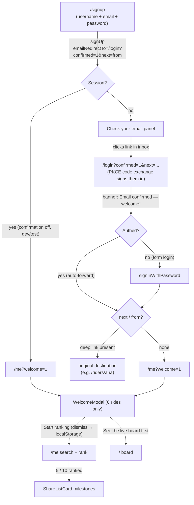
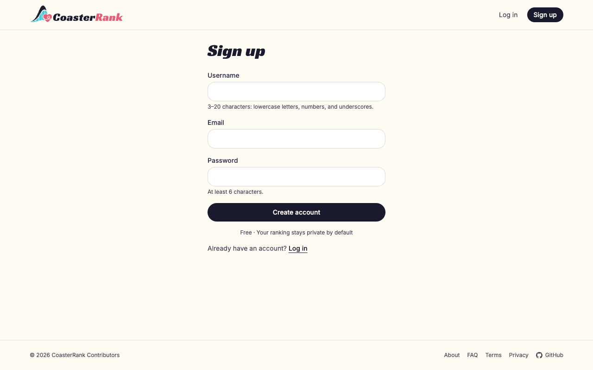
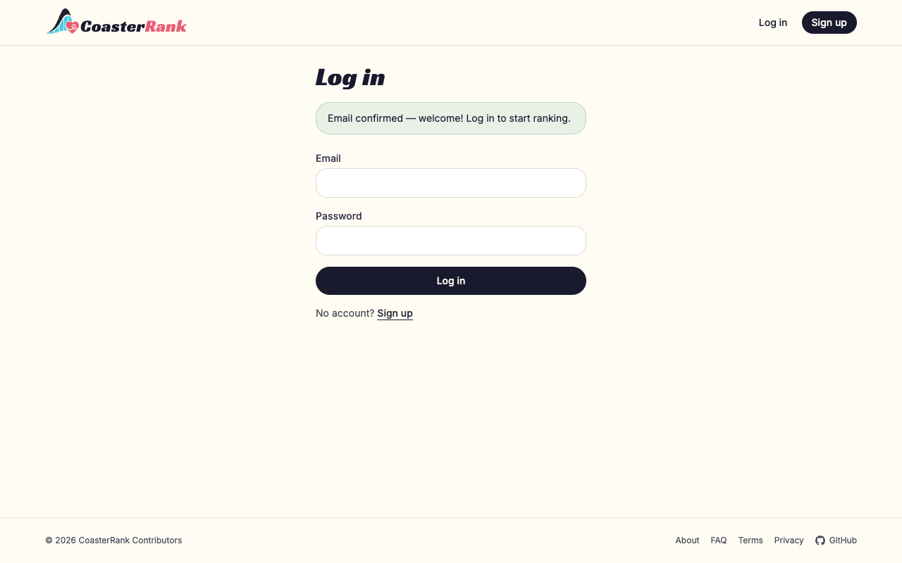
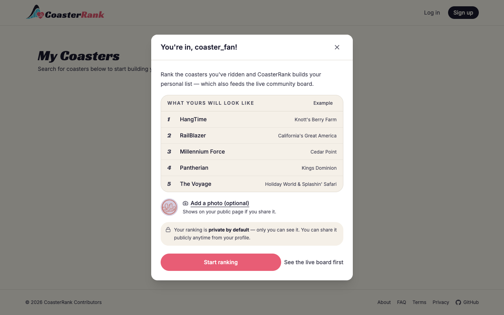
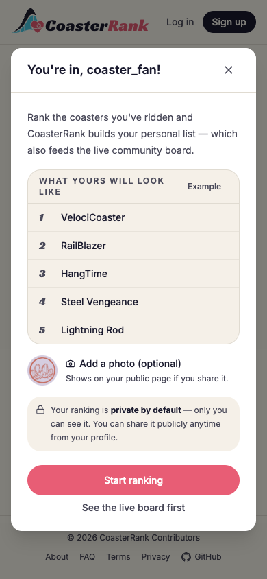

# Signup → first ranking flow (PR evaluation)

> Evaluation artifacts for the signup welcome-flow change. Screenshots were
> taken against the local dev server with live board data; the modal shots
> use a temporary preview harness (since removed) with stub identity props.

## Flow diagram

Key properties:

- The confirmation link lands on **public** `/login`, so the PKCE code
  exchange can never race the `RequireAuth` gate (previously it landed on
  `/`, leaving fresh users on the board with no next step).
- Deep links survive the email round-trip: `RequireAuth` stashes `from`
  → signup encodes it as `?next=` → login forwards to it.
- The welcome modal only renders for confirmed users with **zero rides**;
  dismissal persists in `localStorage` (`cr.welcome.dismissed`) and clears
  the `?welcome` param.
- Privacy is stated three times, progressively: signup microcopy
  ("private by default") → modal lock-note → profile share opt-in.

## Screenshots

### 1. Signup — private-by-default microcopy under the CTA

### 2. Login landing straight from the confirmation email

### 3. Welcome modal — example top-5 preview, optional avatar, privacy note

### 4. Welcome modal — mobile

