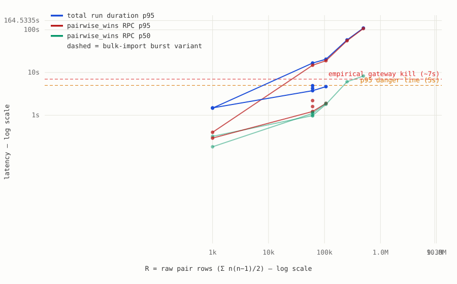

# `pairwise_wins()` scale benchmark — results

_Generated `2026-09-13T15:48:14.754Z` from 50 recorded recompute runs on the disposable staging project — a restore of the prod backup (2026-09-12 dump) plus migrations. PostgREST max-rows was raised to 1M so nothing is truncated; pg_cron is disabled there; every run was triggered manually, exactly like the admin "Recompute now" button does._

## TL;DR

| variant   | reliable through R | first failure | cliff (majority-fail) | wall at the cliff                         |
| --------- | ------------------ | ------------- | --------------------- | ----------------------------------------- |
| a-dirty   | 61k                | 106k          | 106k                  | edge-function OOM (WORKER_RESOURCE_LIMIT) |
| b-plpgsql | 495k               | 1.7M          | 1.7M                  | SQL statement timeout                     |
| baseline  | 61k                | 106k          | 106k                  | edge-function OOM (WORKER_RESOURCE_LIMIT) |
| burst     | 61k                | —             | —                     | —                                         |

- **a-dirty**: — every run passes through R ≈ 61k (50×50: run 3,234ms–4,917ms, payload 7.0MB) — majority of runs fail at R ≈ 106k — ~2× today's prod load (prod R ≈ 50k, 10 ranking users).
- **b-plpgsql**: — every run passes through R ≈ 495k (100×100: run 10,063ms–109,689ms, payload 0.2MB) — majority of runs fail at R ≈ 1.7M — ~33× today's prod load (prod R ≈ 50k, 10 ranking users).
- **baseline**: — every run passes through R ≈ 61k (50×50: run 3,557ms–3,759ms, payload 7.0MB) — majority of runs fail at R ≈ 106k — ~2× today's prod load (prod R ≈ 50k, 10 ranking users).
- **burst**: — every run passes through R ≈ 61k (50×50: run 3,697ms–4,266ms, payload 7.0MB).

Failure modes observed (a failed run only reports the first wall it hits):

- 13× edge-function OOM (WORKER_RESOURCE_LIMIT)
- 5× SQL statement timeout

**What this means:** the baseline's binding constraint is _edge-function memory_ — the pair JSON payload loads into the Deno worker and dies (HTTP 546 `WORKER_RESOURCE_LIMIT`) past ~12MB, only ~2× today's prod load. Variant **a-dirty** (trigger-maintained pair table) speeds up the SQL a little but ships the same payload, so the memory wall does not move. Variant **b-plpgsql** (aggregation + MM fit in-database, warm-started from the previous board) collapses the payload to board-size (~0.1MB) and survives four times past the baseline's cliff — its own wall is the _aggregation statement_ vs the platform's ~8s per-statement timeout at R ≈ 1.7M. **Combining them removes both walls**: the maintained pair table eliminates the per-run aggregation statement, and the in-DB fit eliminates the payload — the epic-ready promotion design (app-set dirty flags + reconciliation sweep, two-level delta-maintained totals, batch temp tables, temp_buffers, vacuum strategy) is spec'd in [PROMOTION.md](PROMOTION.md). Independent of variants, prod itself already shows `pairwise_wins` calls at 4.5–12s with two gateway-504 errors on 2026-09-12, and its board is fitted on a max-rows-truncated 10k-row prefix of its 50k pairs.

## How to read this

- **R** ("raw pair rows") is the amount of work one recompute must chew through: every ranked rider contributes `n(n−1)/2` rows, one per ordered coaster pair they ranked. It grows _quadratically_ with list length and _linearly_ with user count — e.g. 100 users ranking 100 coasters each = ~495k rows. Today's prod: R ≈ 50k.
- **RPC p95** is the time the single `pairwise_wins` HTTP call took (SQL execution + JSON serialization + transfer) on 95% of runs. The platform kills these calls at roughly ~7s, so the **5s danger line** is the real planning boundary.
- **Duration p95** is the whole recompute (3 RPCs + ~10 sequential write roundtrips + MM fit).
- The **bulk-import burst** variant inserts all rides in one transaction and recomputes immediately, with no fresh `ANALYZE` — approximating what happens right after a mass import in prod.
- **Cold vs warm:** the FIRST recompute after a board reset fits from scratch (80–160 MM iterations); every subsequent run warm-starts from the previous board and converges in 1–3 iterations. p95 spans both; p50 reflects the warm steady state, which is what the 15-minute cron actually experiences. For **b-plpgsql** the `pairs` column counts fitted board rows (its RPC ships the board, not pair rows), so it is much smaller than the other variants' distinct-pair counts by design.

## The chart



## Per-point numbers

| point             | R    | passed | errors | RPC p50 | RPC p95   | run p50  | run p95   | pairs (median) | payload | iters |
| ----------------- | ---- | ------ | ------ | ------- | --------- | -------- | --------- | -------------- | ------- | ----- |
| a-dirty 50x50     | 61k  | 5/5    | 0      | 970ms   | 2,202ms   | 3,234ms  | 4,917ms   | 55,092         | 7.0MB   | 80    |
| a-dirty 60x60     | 106k | 0/3    | 3      | —       | —         | —        | —         | —              | —       | —     |
| b-plpgsql 20x10   | 900  | 4/4    | 0      | 321ms   | 399ms     | 964ms    | 1,470ms   | 165            | 0.0MB   | 35    |
| b-plpgsql 50x50   | 61k  | 3/3    | 0      | 982ms   | 14,813ms  | 2,324ms  | 16,662ms  | 876            | 0.1MB   | 1     |
| b-plpgsql 60x60   | 106k | 3/3    | 0      | 1,802ms | 18,907ms  | 3,331ms  | 20,471ms  | 982            | 0.1MB   | 1     |
| b-plpgsql 80x80   | 253k | 3/3    | 0      | 6,086ms | 55,513ms  | 7,803ms  | 57,878ms  | 1,103          | 0.1MB   | 1     |
| b-plpgsql 100x100 | 495k | 3/3    | 0      | 8,283ms | 107,006ms | 10,063ms | 109,689ms | 1,202          | 0.2MB   | 1     |
| b-plpgsql 150x150 | 1.7M | 0/2    | 2      | —       | —         | —        | —         | —              | —       | —     |
| b-plpgsql 200x250 | 6.2M | 0/1    | 1      | —       | —         | —        | —         | —              | —       | —     |
| baseline 20x10    | 900  | 2/2    | 0      | 183ms   | 292ms     | 933ms    | 1,488ms   | 898            | 0.1MB   | 35    |
| baseline 50x50    | 61k  | 5/5    | 0      | 1,106ms | 1,225ms   | 3,557ms  | 3,759ms   | 55,092         | 7.0MB   | 80    |
| baseline 60x60    | 106k | 1/5    | 4      | 1,896ms | 1,896ms   | 4,675ms  | 4,675ms   | 91,110         | 11.6MB  | 90    |
| baseline 80x80    | 253k | 0/3    | 3      | —       | —         | —        | —         | —              | —       | —     |
| baseline 100x100  | 495k | 0/3    | 3      | —       | —         | —        | —         | —              | —       | —     |
| baseline 150x150  | 1.7M | 0/1    | 1      | —       | —         | —        | —         | —              | —       | —     |
| baseline 200x250  | 6.2M | 0/1    | 1      | —       | —         | —        | —         | —              | —       | —     |
| burst 50x50       | 61k  | 3/3    | 0      | 1,168ms | 1,598ms   | 3,697ms  | 4,266ms   | 55,092         | 7.0MB   | 80    |

## Growth simulation (accumulation + churn)

Real communities don't reset and reseed — users ACCUMULATE and each cron slot processes only the dirty set (new users + existing users who edited rankings). This simulation walks epochs of `{totalUsers, existingEditors}` from 10 users toward 1,000 (uniform 50-ride lists, plus bulk-import burst users with 220 rides at three points), keeping state between epochs, with two runs per epoch: **apply** (right after the changes) and **idle** (nothing changed — the steady-state floor).

### ab-combined

| epoch | total users | new | editors | dirty | R (total) | apply run                      | idle run                       |
| ----- | ----------- | --- | ------- | ----- | --------- | ------------------------------ | ------------------------------ |
| 1     | 10          | 10  | 0       | 10    | 12,250    | 3,612ms / rpc 2,402ms          | 1,665ms / rpc 609ms            |
| 2     | 20          | 10  | 2       | 11    | 24,500    | 5,432ms / rpc 3,677ms          | 2,218ms / rpc 944ms            |
| 3     | 25          | 5   | 1       | 6     | 30,625    | 5,763ms / rpc 4,167ms          | 3,026ms / rpc 1,109ms          |
| 4     | 50          | 25  | 5       | 27    | 61,250    | 12,961ms / rpc 11,025ms        | 3,959ms / rpc 2,196ms          |
| 5     | 101         | 50  | 10      | 53    | 146,590   | 31,308ms / rpc 29,125ms        | 7,263ms / rpc 5,289ms          |
| 6     | 200         | 99  | 15      | 107   | 267,865   | 79,481ms / rpc 77,049ms        | 9,218ms / rpc 6,999ms          |
| 7     | 351         | 150 | 20      | 163   | 475,705   | FAILED (SQL statement timeout) | FAILED (SQL statement timeout) |
| 8     | 500         | 149 | 25      | 168   | 658,230   | FAILED (SQL statement timeout) | FAILED (SQL statement timeout) |

### baseline

| epoch | total users | new | editors | dirty | R (total) | apply run                                          | idle run                                           |
| ----- | ----------- | --- | ------- | ----- | --------- | -------------------------------------------------- | -------------------------------------------------- |
| 1     | 10          | 10  | 0       | —     | 12,250    | 1,797ms / rpc 672ms                                | 1,285ms / rpc 438ms                                |
| 2     | 20          | 10  | 2       | —     | 24,500    | 3,223ms / rpc 1,148ms                              | 2,045ms / rpc 640ms                                |
| 3     | 25          | 5   | 1       | —     | 30,625    | 2,509ms / rpc 751ms                                | 2,285ms / rpc 821ms                                |
| 4     | 50          | 25  | 5       | —     | 61,250    | 3,412ms / rpc 1,170ms                              | 3,733ms / rpc 1,011ms                              |
| 5     | 101         | 50  | 10      | —     | 146,590   | FAILED (edge-function OOM (WORKER_RESOURCE_LIMIT)) | FAILED (edge-function OOM (WORKER_RESOURCE_LIMIT)) |
| 6     | 200         | 99  | 15      | —     | 267,865   | FAILED (edge-function OOM (WORKER_RESOURCE_LIMIT)) | FAILED (edge-function OOM (WORKER_RESOURCE_LIMIT)) |

**Break points (ab-combined):** the _dirty axis_ breaks when one `bench_fit_maintain` call outgrows the ~8s statement timeout (~100–200 dirty users in a single epoch); the _total axis_ breaks when the O(R) aggregation scan of the maintained pair rows outgrows it (R ≈ 475k+, ~350+ users here) — both are statement-boundary problems with known refinements (batch the maintain call across RPCs; two-level incremental pair totals), NOT memory walls. Watch the idle floor: it grows with total R (the per-run scan + warm fit), ~1.7s at R=12k → ~9s at R=268k. Also visible: repeated delete+rewrite of dirty users' pair rows bloats the table between vacuums — later epochs get slower than fresh ones (autovacuum dependency; a production promotion must account for it).

**Contrast:** on the identical ladder the **baseline died at 100 users** (+1 burst user, R ≈ 147k): the pair payload crossed the edge function's memory limit and every subsequent run OOMs — dirty tracking or not, the current production shape cannot ride a growing community past ~100 users. The combined variant processed the same epochs alive (79s apply at 200 users / 107 dirty — slow, refinable, but no memory wall) and only broke at ~350–500 users on a statement timeout.

## Method / reproduce

```bash
cd scripts
npm run bench -- sweep              # full grid (reset → seed → K recomputes per point)
npm run bench -- run --users 50 --rides 50 --repeats 5   # single point
npm run bench -- report             # regenerate this file + chart + csv
```

Environment: staging project `jsvgzvkrgodaxdutqcok` (West US/Oregon, same region as prod), schema = 2026-09-12 prod dump + migrations through `20260912190000`, recompute-rankings deploy digest `c52405002a89`, PostgREST max-rows 1,000,000. Raw samples: [data/runs.jsonl](data/runs.jsonl); flat CSV: [results.csv](results.csv).
